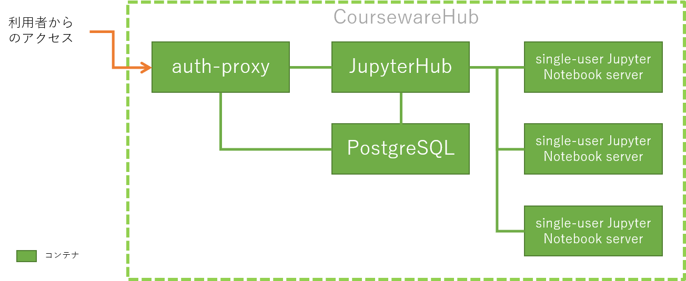
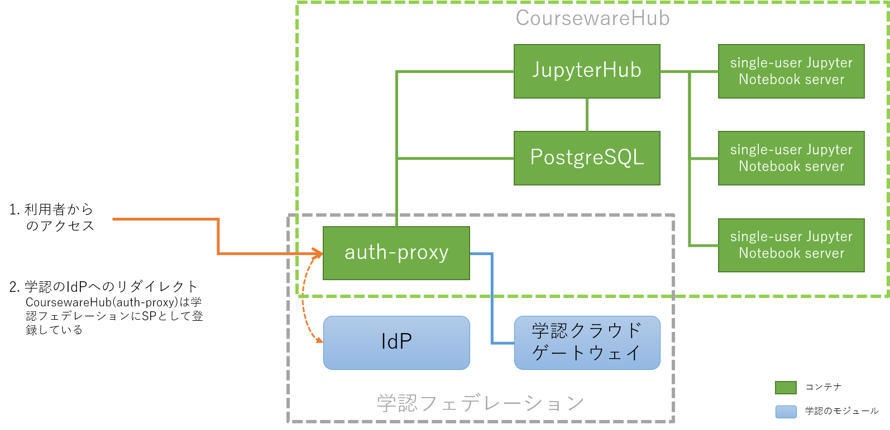
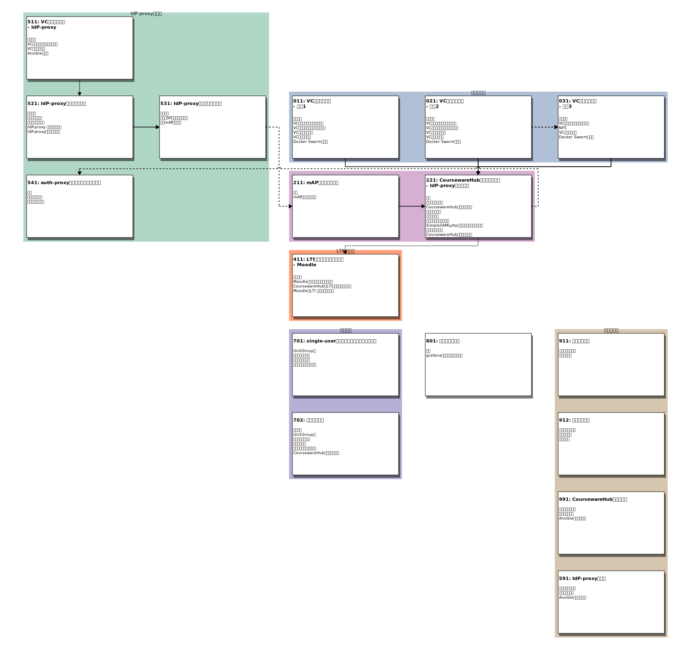
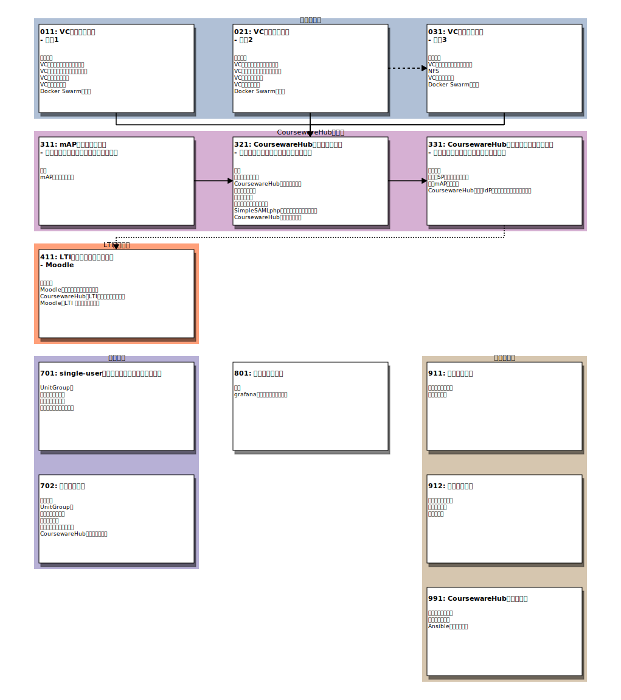

# README

VCP SDKを用いてクラウド上にCoursewareHub環境を構築します。

## 変更履歴

###  [20.04.0](https://github.com/nii-gakunin-cloud/ocs-templates/releases/tag/release%2F20.04.0)からの変更点


主に[NII-cloud-operation/CoursewareHub-LC_platform](https://github.com/NII-cloud-operation/CoursewareHub-LC_platform)の [#14](https://github.com/NII-cloud-operation/CoursewareHub-LC_platform/pull/14)から[#25](https://github.com/NII-cloud-operation/CoursewareHub-LC_platform/pull/25)までの変更内容を取り込んでいます。

追加された主要な機能を以下に記します。

* 学認連携に基づく認証
* LMS(Learning Management System)との認証連携
* managerノードとNFSサーバを別ノードとして構成することを選択できるようになった
* single-userコンテナに割り当てるリソース量をグループや認可タイプ毎に設定できるようになった

## はじめに

このアプリケーションテンプレートではVCPで作成したノードに[CoursewareHub](https://github.com/NII-cloud-operation/CoursewareHub-LC_jupyterhub-deploy)環境を構築します。

### CoursewareHubのユーザ認証について

CoursewareHubではユーザの認証機能として以下に示す三つの方式に対応しています。

* ローカルユーザ認証
    * CoursewareHubのローカルユーザデータベースを用いてユーザ管理を行う
* 学認連携に基づく認証
    * [学認](https://www.gakunin.jp/)のSPとして登録し、認証連携を行う
    * CoursewareHubを直接SPとしては登録せずに、プロキシ(IdPプロキシ)を経由して連携することも可能
* LMS(Learning Management System)との認証連携
    * [LTI 1.3](http://www.imsglobal.org/spec/lti/v1p3/)による認証連携を行う
    * アプリケーションテンプレートでは連携するLMSとして[Moodle](https://moodle.org/)を想定している

それぞれの認証機能は共存することが可能になっています。ただし、学認連携認証を用いる場合はコンテナの構成や設定手順が異なります。そのため、それに応じた異なる構築手順を用意しています。

一方 LMSとの認証連携を行う場合は、まずローカルユーザ認証、あるいは学認連携認証の手順でCoursewareHubを構築してください。その後にLMSとの認証連携の設定を追加する手順となっています。

### コンテナの構成について

ローカルユーザ認証のみを用いる場合と、学認連携認証を利用する場合とではコンテナの構成が異なります。ここでは、それぞれのコンテナ構成について記します。

CoursewareHubでは、学認連携の有無、あるいは連携方法の違いにより以下に示す方式を選択することができます。
* ローカルユーザ認証のみを利用する
* 学認フェデレーションに参加し、学認のIdPを利用して認証を行う
    - IdP-proxyをSPとして学認に登録し、複数のCoursewareHubがIdP-proxyを通して学認のIdPを利用する
    - CoursewareHubを直接SPとして学認に登録する
    
それぞれの方式に対応する構成図を以下に示します。
    
#### ローカルユーザ認証のみを利用する場合



#### IdP-proxyを利用する場合


#### CoursewareHubを直接SPとして登録する場合



### ノード構成

CoursewareHubのノードは役割に応じて以下のものに分類されます

* manager
    - JupyterHub, auth-proxy, PostgreSQLなどのSystemコンテナを実行するノード
    - Docker Swarmのmanagerノードとなる
* worker
    - single-user Jupyter notebook serverを実行するノード
    - Docker Swarm の workerノードとなる
    
CoursewareHubではデータやNotebookなどをノード間で共有するためにNFSを利用します。NFSサーバの配置により以下の３つパターン構成が可能となっています。

1. 構成1
    - managerノードにNFSサーバを配置する
1. 構成2
    - managerノードとNFSサーバを別のノードとして構成する
1. 構成3
    - 構成2のNFSサーバに、新たなCoursewareHub環境を追加する構成

#### 構成1

managerノードでNFSサーバを実行します。


#### 構成2

managerノードとNFSサーバを分離し別々のノードとして構築します。


#### 構成3

構成2のNFSサーバに、新たなCoursewareHub環境を追加します。NFSサーバは複数のCoursewareHub環境で共有されます。


### 収容設計について

#### managerノード

* システム用コンテナが実行される
    - auth-proxyコンテナ
    - JupyterHubコンテナ
    - PostgreSQLコンテナ
* ユーザが利用する single-userサーバコンテナは実行されない
* NFSサーバをmanagerノードに共存させる場合（構成１）はディスク容量を適切な値に設定する

#### workerノード

* ユーザが利用するsingle-userコンテナが実行される
* single-userコンテナのリソース量として以下の設定を行っている
    - 最大CPU利用数
    - 最大メモリ量(GB)
    - 保証される最小割当てメモリ量(GB)
* システム全体で必要となるリソース量を見積もるには
    - (コンテナに割り当てるリソース量)×(最大同時使用人数)+(システムが利用するリソース量)×(ノード数)
    
#### 運用例

* 最大同時使用人数
    - 400 人
* コンテナに割り当てるリソース量
    - メモリ最小値保証
        - 1GB
    - メモリ最大値制限
        - 2GB(swap 4GB)
    - CPU最大値制限
        - 200% (2cores)
        
上記の条件で運用を行った際の実績値を示します。

* managerノード
    - vCPU
        - 10
    - memory
        - 16GB
    - HDD
        - 800GB
* workerノード
  - ノードA
    - ノード数
        - 4
    - vCPU
        - 30
    - memory
        - 100GB
    - HDD
        - 300GB
  - ノードB
    - ノード数
        - 1
    - vCPU
        - 20
    - memory
        - 80GB
    - HDD
        - 300GB

> workerノードはリソース量の異なるノードAとノードBで構成されていた。

workerノードのメモリ総量は480GB(=100×4+80)となっていますが、これは以下のように見積もっています。
```
(コンテナのメモリ最小値保証)×(最大同時使用人数)+(システム利用分)
= 1GB × 400人 + 80GB
```

## 事前に準備が必要となるものについて

このアプリケーションテンプレートを実行するにあたって事前に準備が必要となるものについて記します。

### VCノード

ノードを作成するとき必要となるものについて記します。

* VCCアクセストークン
    - VCP SDKを利用してクラウド環境にノード作成などを行うために必要となります
    - VCCアクセストークンがない場合はVC管理者に発行を依頼してください
* SSH公開鍵ペア
    - VCノードに登録するSSHの公開鍵
    - このNotebook環境内で新たに作成するか、事前に作成したものをこの環境にアップロードしておいてください
* VCノードに割り当てるアドレス
    - ノードのネットワークインタフェースに以下に示す何れかのアドレスを指定することができます
        - IPアドレス
        - MACアドレス
* NTPの設定
    - 学認フェデレーションに参加し SAML 認証を利用する場合、正しい時刻設定が必要となります
    - VCノードのNTPサービスを有効にするためには、事前にVCコントローラへの設定が必要となります
    - VCコントローラへの設定にはOCS運用担当者への申請が必要となります

### CoursewareHub

CoursewareHubを構築する際に必要となるものについて記します。

* CoursewareHubのサーバ証明書
    - CoursewareHubではHTTPSでサーバを公開するため、サーバ証明書とその秘密鍵が必要となります
    - 必要に応じて、サーバ証明書の中間CA証明書を準備してください
    - サーバ証明書に記載されているホスト名のDNS登録も必要となります

また事前の段階では不要ですが、学認のIdPを認証に利用する場合は構築手順の過程で
学認フェデレーションに参加の申請を行う必要があります。

### IdP-proxy

IdP-proxy を構築する際に必要となるものについて記します。

* IdP-proxyのサーバ証明書
    - IdP-proxyではHTTPSでサーバを公開するため、サーバ証明書とその秘密鍵が必要となります
    - 必要に応じて、サーバ証明書の中間CA証明書を準備してください
    - サーバ証明書に記載されているホスト名のDNS登録も必要となります

また事前の段階では不要ですが、学認のIdPを認証に利用する場合は構築手順の過程で
学認フェデレーションに参加の申請を行う必要があります。

## Notebookの一覧


### 各Notebookの関連について

テンプレートとなるNotebookの関係を示す図を以下に示します。図に表示される１つのブロックが１つのNotebookに対応しています。

#### ローカルユーザ認証のみを利用する場合
[](images/notebooks0-a.svg)

#### IdP-proxyを利用する場合
[](images/notebooks0-b.svg)

#### CoursewareHubを直接SPとして登録する場合
[](images/notebooks0-c.svg)

### Notebookの目次

各Notebookの目次を示します。リンクが表示されている項目が一つのNotebookに対応しています。

* [011: VCノードの作成--構成1](notebooks/011-VCノード作成-構成1.ipynb)
    1. はじめに
        - このNotebookではCoursewareHub環境を構築するためのノード作成を行います
    1. VCノードに関するパラメータ
        - CoursewareHubの構築環境となるVCノードに関するパラメータを指定します
    1. VCディスクに関するパラメータ
        - CoursewareHubに関するデータやNotebook、ユーザのホームディレクトリなどに利用するVCディスクに関するパラメータを指定します
    1. VCディスクの作成
        - NFS用のVCディスクを作成します
    1. VCノードの起動

    1. Docker Swarmの設定
        - Docker Swarm の設定を行います
* [021: VCノードの作成--構成2](notebooks/021-VCノード作成-構成2.ipynb)
    1. はじめに
        - このNotebookではCoursewareHub環境を構築するためのノード作成を行います
    1. VCノードに関するパラメータ
        - CoursewareHubの構築環境となるVCノードに関するパラメータを指定します
    1. VCディスクに関するパラメータ
        - CoursewareHubに関するデータやNotebook、ユーザのホームディレクトリなどに利用するVCディスクに関するパラメータを指定します
    1. VCディスクの作成
        - NFS用のVCディスクを作成します
    1. VCノードの起動

    1. Docker Swarmの設定
        - Docker Swarm の設定を行います
* [031: VCノードの作成--構成3](notebooks/031-VCノード作成-構成3.ipynb)
    1. はじめに
        - このNotebookでは構成2で構築したNFSサーバに、新たなCoursewareHub環境を追加するためのノード作成を行います(構成3)
    1. VCノードに関するパラメータ
        - CoursewareHubの構築環境となるVCノードに関するパラメータを指定します
    1. NFS

    1. VCノードの起動

    1. Docker Swarmの設定
        - Docker Swarm の設定を行います
* [121: CoursewareHubのセットアップ--ローカルユーザ認証](notebooks/121-CoursewareHubのセットアップ-ローカルユーザ認証.ipynb)
    1. 概要
        - このNotebookで構築するCoursewareHubの構成要素を以下に示します
    1. パラメータの設定

    1. CoursewareHubのセットアップ
        - CoursewareHubの構成要素となる、各コンテナのセットアップを行います
    1. コンテナの起動

    1. 管理者の追加

    1. コンテンツの配備の準備
        - CoursewareHubのコンテンツを格納するディレクトリを作成し、コンテンツの配置を行うNotebookを管理者のホームディレクトリに配置します
    1. CoursewareHubにアクセスする
        - 構築環境にアクセスして、正しく動作していることを確認してください
* [211: mAPのグループ作成](notebooks/211-mAPのグループ作成.ipynb)
    1. 概要
        - CoursewareHubでは学認mAPのグループ機能を利用してユーザを管理します
    1. mAPグループの作成
        - [学認クラウドゲートウェイサービス](https://cg.gakunin.jp/)またはSP検証環境(テストフェデレーションの場合)にアクセスしてグループの作成などを行います
* [221: CoursewareHubのセットアップ--IdP-proxyを利用する](notebooks/221-CoursewareHubのセットアップ.ipynb)
    1. 概要
        - CoursewareHubの構成要素を以下に示します
    1. パラメータの設定

    1. CoursewareHubのセットアップ
        - CoursewareHubの構成要素となる、各コンテナのセットアップを行います
    1. コンテナの起動

    1. 管理者の追加

    1. コンテンツの配備の準備
        - CoursewareHubのコンテンツを格納するディレクトリを作成し、コンテンツの配置を行うNotebookを管理者のホームディレクトリに配置します
    1. SimpleSAMLphpの設定ファイルを更新する
        - SimpleSAMLphpの管理者パスワードの設定などを行うために auth-proxyコンテナのSimpleSAMLphpの設定ファイルを編集します
    1. メタデータの更新
        - 構築したCoursewareHubのメタデータを IdP-proxy に登録するまでは、学認によるログインを利用できません
    1. CoursewareHubにアクセスする
        - 構築環境にアクセスして、正しく動作していることを確認してください
* [311: mAPのグループ作成--直接学認フェデレーションを利用する](notebooks/311-mAPのグループ作成.ipynb)
    1. 概要
        - CoursewareHubでは学認mAPのグループ機能を利用してユーザを管理します
    1. mAPグループの作成
        - [学認クラウドゲートウェイサービス](https://cg.gakunin.jp/)またはSP検証環境(テストフェデレーションの場合)にアクセスしてグループの作成などを行います
* [321: CoursewareHubのセットアップ--直接学認フェデレーションを利用する](notebooks/321-CoursewareHubのセットアップ.ipynb)
    1. 概要
        - CoursewareHubの構成要素を以下に示します
    1. パラメータの設定

    1. CoursewareHubのセットアップ
        - CoursewareHubの構成要素となる、各コンテナのセットアップを行います
    1. コンテナの起動

    1. 管理者の追加

    1. コンテンツの配備の準備
        - CoursewareHubのコンテンツを格納するディレクトリを作成し、コンテンツの配置を行うNotebookを管理者のホームディレクトリに配置します
    1. SimpleSAMLphpの設定ファイルを更新する
        - 構築環境のメタデータに設定されている技術的問い合わせ先などの情報を更新するために SimpleSAMLphpの設定ファイルを編集します
    1. CoursewareHubにアクセスする
        - 構築環境にアクセスして、正しく動作していることを確認してください
* [331: CoursewareHubの登録を学認へ申請する--直接学認フェデレーションを利用する](notebooks/331-CoursewareHubの登録を学認へ申請する.ipynb)
    1. はじめに
        - CoursewareHubの構成要素を以下に示します
    1. 学認にSP設置の申請を行う
        - 申請を行う前に学認（GakuNin）の「[参加情報](https://www.gakunin.jp/join)」にてフェデレーション参加の流れを確認してください
    1. 学認mAPとの連携
        - CoursewareHubでは利用者をグループ管理するために[学認mAP](https://meatwiki.nii.ac.jp/confluence/display/gakuninmappublic/Home)を利用します
    1. CoursewareHubに学認IdPのアカウントでログインする
        - 学認IdPのアカウントでCoursewareHubにログインできることを確認します
* [411: LTI認証連携の設定を行う -- Moodle](notebooks/411-LTI認証連携の設定を行う.ipynb)
    1. はじめに

    1. Moodleで外部ツールの設定を行う
        - CoursewareHubとLTI認証連携を行う Moodle にて、外部ツールの設定を行います
    1. CoursewareHubにLTI認証連携設定を行う

    1. MoodleでLTI リンクを作成する
        - MoodleのサイトまたはコースのページにLTIリンクを作成します
* [511: VCノードの作成--IdP-proxy](notebooks/511-VCノード作成-IdP-proxy.ipynb)
    1. はじめに

    1. VCノードに関するパラメータ
        - IdP-Proxyの構築環境となるVCノードに関するパラメータを指定します
    1. VCノードの起動
        - VCノードを起動します
    1. Ansibleの設定
        - VCノードをAnsibleで操作するための設定を行います
* [521: IdP-proxyのセットアップ](notebooks/521-IdP-proxyのセットアップ.ipynb)
    1. はじめに

    1. 操作対象の設定
        - 操作対象となるAnsibleのグループ名を指定します
    1. パラメータの設定

    1. IdP-proxy コンテナの準備

    1. IdP-proxyコンテナの起動

* [531: IdP-proxyを学認へ申請する](notebooks/531-IdP-proxyを学認へ申請する.ipynb)
    1. はじめに
        - CoursewareHubの構成要素を以下に示します
    1. 学認にSP設置の申請を行う
        - 申請を行う前に学認（GakuNin）の「[参加情報](https://www.gakunin.jp/join)」にてフェデレーション参加の流れを確認してください
    1. 学認mAPとの連携
        - CoursewareHubでは利用者グループを管理するために[学認mAP](https://meatwiki.nii.ac.jp/confluence/display/gakuninmappublic/Home)を利用します
* [541: auth-proxyのメタデータを登録する](notebooks/541-IdP-proxyへauth-proxyのメタデータを登録する.ipynb)
    1. 概要
        - このNotebookでは「221-CoursewareHubのセットアップ.ipynb」で構築したCoursewareHub環境のauth-proxyからメタデータを取得してIdP-proxyへの登録を行います
    1. 操作対象の設定
        - 操作対象となるAnsibleのグループ名を指定します
    1. メタデータの追加
        - CoursewareHub(auth-proxy)のメタデータをIdP-proxyに登録します
* [591: IdP-proxyの削除](notebooks/591-IdP-proxyの削除.ipynb)
    1. パラメータの指定

    1. 構築環境の削除
        - 起動したVCノードを削除します
    1. Ansible設定のクリア
        - 削除した環境に対応するAnsibleの設定をクリアします
* [701:  single-userのコンテナイメージを変更する](notebooks/701-sinleuserコンテナイメージの変更.ipynb)
    1. UnitGroup名
        - 操作対象となるVCPのUnitGroup名を指定します
    1. コンテナイメージ
        - 新たに設定する single-userコンテナのイメージ名を指定してください
    1. 現在の設定を確認
        - single-user serverとして設定されている現在のコンテナイメージのIDを確認します
    1. コンテナイメージの変更
        - single-user serverのコンテナイメージを指定されたものに変更します
* [702: 管理者の追加](notebooks/702-管理者の追加.ipynb)
    1. はじめに
        - このNotebookは、CoursewareHub環境構築の際に誤った管理者情報を登録したなどの理由により、CoursewareHub環境に管理者としてログインできるユーザが存在しないなどの状況を回避するためのものです
    1. UnitGroup名
        - 操作対象となるVCPのUnitGroup名を指定します
    1. パラメータの設定
        - 追加する管理者の情報を指定します
    1. 管理者の追加

    1. コンテンツの配備の準備
        - CoursewareHubのコンテンツを格納するディレクトリを作成し、コンテンツの配置を行うNotebookを管理者のホームディレクトリに配置します
    1. CoursewareHubにアクセスする
        - 追加した管理者ユーザでログインできることを確認してください
* [801: リソース可視化](notebooks/801-リソース可視化.ipynb)
    1. 概要
        - 以下に示す３つのダッシュボードをgrafanaに追加し、CoursewareHub環境のリソース利用状況を可視化します
    1. grafanaダッシュボードの登録
        - VC Controllerに配備されている grafana にダッシュボードを登録します
* [911: ノードの停止](notebooks/911-ノードの停止.ipynb)
    1. パラメータの指定
        - ノードの停止を行うのに必要となるパラメータを入力します
    1. ノードの停止
        - 現在のノードの状態を確認します
* [912: ノードの再開](notebooks/912-ノードの再開.ipynb)
    1. パラメータの指定
        - ノードを再開するのに必要となるパラメータを入力します
    1. ノードの再開
        - 現在のノードの状態を確認します
    1. 状態の確認
        - docker swarmで実行しているサービスの状態を確認します
* [991: CoursewareHub環境の削除](notebooks/991-CoursewareHub環境の削除.ipynb)
    1. パラメータの指定

    1. 構築環境の削除

    1. Ansible設定のクリア
        - 削除した環境に対応するAnsibleの設定をクリアします