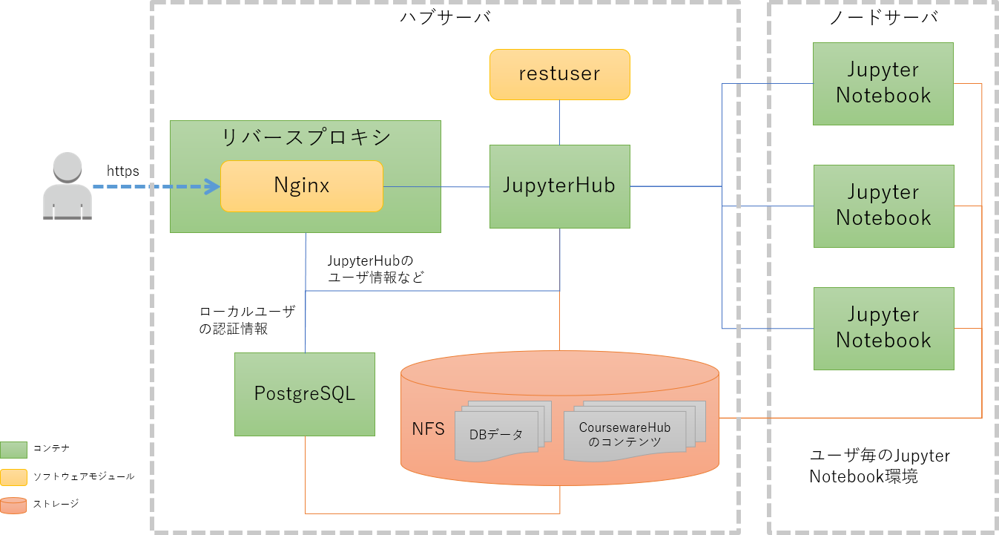
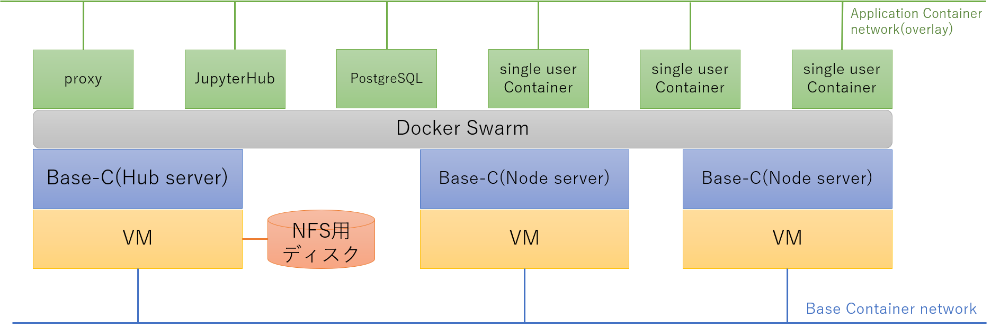

# README

VCP SDKを用いてクラウド上にCoursewareHub環境を構築します。

## はじめに

### 構成

このテンプレートで構築する[CoursewareHub](CoursewareHub-LC_platform)環境の構成を以下の図に示します。

### 認証について

[NII-cloud-operation](https://github.com/NII-cloud-operation) が公開しているCoursewareHub構築手順では[学術認証フェデレーション](https://www.gakunin.jp/)を利用した認証を行っています。このテンプレートでは構築手順を簡略化するために、学認を利用した認証には対応していません。ローカルユーザの認証のみに対応しています。

### コンテナ配備について

CoursewareHub環境のコンテナは全て docker swarm 上で実行されます。VCP SDKが作成するVM/Base ContainerとCoursewareHubのコンテナの配備の関係を以下の図に示します。

## 事前の準備

このアプリケーションテンプレートを実行する前に、以下のものを準備しておいてください。

* CoursewareHub環境を公開するときのURL
* URLに対応するサーバ証明書とその秘密鍵
* CoursewareHubを構築する仮想マシンにSSHでログインする際に用いるSSHの公開鍵の秘密鍵

SSHの公開鍵、秘密鍵は事前にこのNotebook環境にアップロードしておいてください。

## Notebookの一覧

このテンプレートが提供するNotebookの目次を以下に示します。

* [001: VCノードの起動](001-VCノードの起動.ipynb)
    1. 構成
    1. VCノードに関するパラメータ
    1. VCディスクに関するパラメータ
    1. VCディスクの作成
    1. VCノードの起動
    1. Ansibleの設定
    1. Docker Swarmの設定
* [002:  CoursewareHubのセットアップ](002-CoursewareHubのセットアップ.ipynb)
    1. 構成
    1. 準備
    1. パラメータの設定
    1. JupyterHubのインストール
    1. 管理者の追加
    1. コンテンツの準備
    1. CoursewareHubにアクセスする
* [901: CoursewareHub環境の削除](901-CoursewareHub環境の削除.ipynb)
    1. パラメータの指定
    1. 構築環境の削除
    1. Ansible設定のクリア

「001: VCノードの起動」、「002: CoursewareHubのセットアップ」の２つのNotebookを実行することで CoursewareHub環境を構築することができます。また「901: CoursewareHub環境の削除」を実行することで、不要になった構築環境を削除することができます。