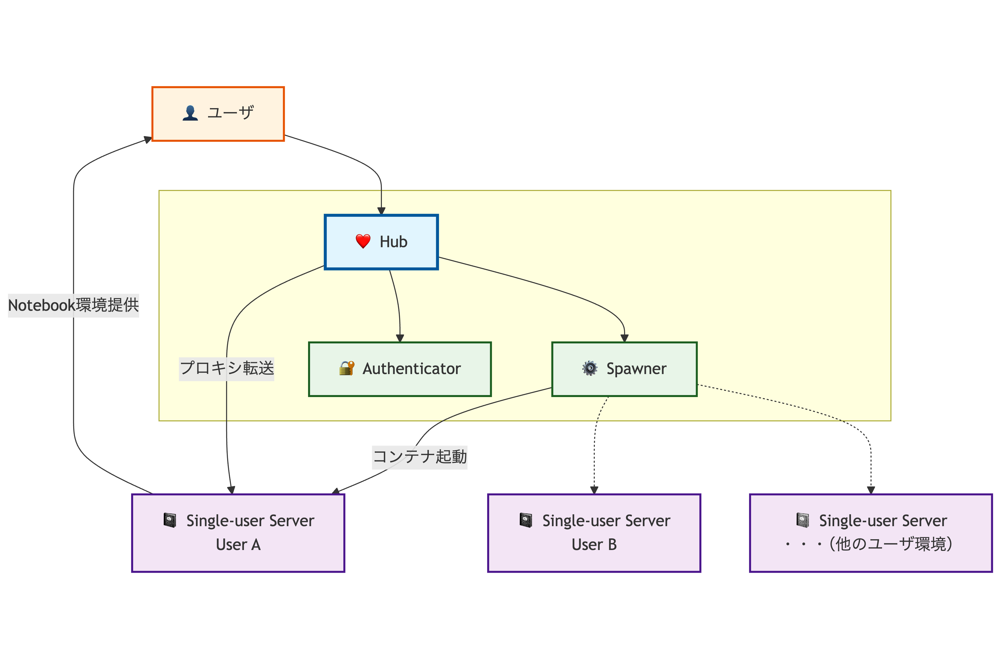

# CoursewareHub

VCP SDKを用いてクラウド上にCoursewareHub環境を構築します。

## 1. 概要

### 1.1. CoursewareHubとは

[CoursewareHub](https://coursewarehub.github.io/)は[Jupyter Notebook](https://jupyter.org/)を用いた講義演習環境を提供するシステムです。大学・研究機関での教育活動においてプログラミング演習やデータサイエンス講義等での利用を想定しています。

**主要機能:**

* **Jupyter Notebook環境の提供**: 受講者がブラウザ経由でプログラミング環境にアクセス
* **教材配布・課題管理**: 講師による教材配布、課題の回答収集機能
* **学習履歴の収集**: 操作履歴や実行状況の収集・分析機能
* **マルチユーザ対応**: 同時に多数のユーザが利用可能な環境
* **LTI連携**: Learning Management System（LMS）との認証連携
* **複数コース管理**: Named Serverを活用した複数コースの同時運用

## 2. JupyterHubの基本概念

CoursewareHubのベースとなる[JupyterHub](https://jupyterhub.readthedocs.io/)の基本的な概念について説明します。

### 2.1. JupyterHubとは

JupyterHubは、複数のユーザが同時にJupyter Notebookを利用できる環境を提供するシステムです。

#### 通常のJupyter Notebookとの違い

* **通常のJupyter**: 1台のPCで1人のユーザが個人的に使用
* **JupyterHub**: 1つのサーバで多数のユーザが同時に安全に使用

#### 講義演習環境への導入メリット

* **統一された環境**: 全ての受講者が同じソフトウェア環境を利用
* **管理効率**: 講師が一元的に環境管理・課題配布
* **スケーラブル**: 受講者数に応じてリソースを調整
* **手軽な利用**: 受講者はブラウザだけでアクセス可能

### 2.2. 主要コンポーネント


<!--
```mermaid
graph TB
        %% External user
        User["👤 ユーザ"]

        %% Single-user servers (独立したサーバ群)
        Server1["📓 Single-user Server<br/>User A"]
        Server2["📓 Single-user Server<br/>User B"]
        ServerN["📓 Single-user Server<br/>・・・（他のユーザ環境）"]

        %% Central Hub
        subgraph HubComponents [" "]
            Hub["❤️ Hub"]
            Spawner["⚙️ Spawner"]
            Auth["🔐 Authenticator"]
        end
        
        %% Data flow arrows
        User - -> Hub
        Spawner - ->|コンテナ起動| Server1
        Hub - ->|プロキシ転送| Server1
        Hub - -> Spawner
        Server1 - ->|Notebook環境提供| User
        Spawner -.-> Server2
        Spawner -.-> ServerN

        Hub - -> Auth

    %% Styling
    classDef hubStyle fill:#e1f5fe,stroke:#01579b,stroke-width:3px
    classDef serverStyle fill:#f3e5f5,stroke:#4a148c,stroke-width:2px
    classDef componentStyle fill:#e8f5e8,stroke:#1b5e20,stroke-width:2px
    classDef userStyle fill:#fff3e0,stroke:#e65100,stroke-width:2px
    
    class Hub hubStyle
    class Server1,Server2,ServerN serverStyle
    class Auth,Spawner componentStyle
    class User userStyle
```
-->

#### Hub
* 各ユーザのNotebook環境の状態管理  
* ユーザのアクセスを適切な環境に転送
* システム全体の管理・監視

#### Spawner
* ユーザがログインしたときに専用環境を起動
* ユーザ毎のリソース制限（CPU・メモリ）
* 使用後の自動停止でリソース節約

#### Single-user Server
* ユーザごとの独立したJupyter Notebook環境
* 作業ファイルはユーザのホームディレクトリで管理
* 他ユーザからサーバ、ファイルともに完全に分離

#### Authenticator
* ユーザの認証、ログイン検証
* ユーザの権限確認

### 2.3. CoursewareHubとの関係

[CoursewareHub](https://coursewarehub.github.io/)は[JupyterHub](https://jupyterhub.readthedocs.io/)をベースに、国立情報学研究所が教育利用向けに拡張したシステムです。

#### JupyterHubの活用部分
* マルチユーザ機能
* スケーラビリティ
* セキュリティ

#### CoursewareHub独自の拡張
* **教材配布機能**: 講師が作成した教材を受講者に一括配布
* **学習履歴収集**: 受講者の操作履歴や実行状況の収集・分析
* **LTI連携**: Moodleなどの学習管理システムとの連携
* **複数コース対応**: 1つのシステムで複数の講義を同時運用


## 3. システム構成とアーキテクチャ

CoursewareHubの構築・運用で必要となるシステム構成について説明します。

### 3.1. CoursewareHubのノード構成

CoursewareHubは、JupyterHubの分散アーキテクチャを基盤として以下のノード構成で動作します：

#### managerノード（管理機能）

* **JupyterHub**: JupyterHubの基本機能（Single-user Serverの管理、リソース制限、ユーザ管理）
* **auth-proxy**: CoursewareHub独自の認証プロキシ
  * LTI連携（Moodleとの連携）
  * 学認連携（大学間連携）
* **PostgreSQL**: ユーザ情報、セッション情報
* **Registry**: Single-user serverのコンテナイメージを保存、配布する
* **NFS共有機能**（基本構成の場合）: ユーザデータの共有ストレージ

#### workerノード（実行環境）

JupyterHubのSingle-user serverを実行する環境です。Single-user serverでは以下の機能を提供します：
* **リソース分離**: ユーザ毎のCPU・メモリ制限とプロセス分離
* **コンテナ実行基盤**: Spawnerにより起動されるコンテナの実行環境
* **講義用コンテナイメージ**: コース毎に用意されたコンテナイメージを使用

#### 分散処理の利点
* **スケーラビリティ**: workerノードを追加することで同時ユーザ数を拡大
* **リソース効率**: managerノードは計算処理を行わず管理に専念
* **障害分離**: 特定のworkerノードの障害が全体システムに影響しない

### 3.2. ストレージとネットワーク構成

#### ストレージ構成
データ共有にはNFSを利用します。以下の構成から選択可能：

**構成1（基本構成）**
* managerノードにNFSサーバを配置する最もシンプルな構成
* 

**その他の構成**
* **構成2**: managerノードとNFSサーバを分離した構成
* **構成3**: 構成2で構築したNFSサーバを共有して、CoursewareHubを構築する構成

#### 認証方式別のコンテナ構成
* **ローカルユーザ認証・LTI連携**: 
* **学認連携**: IdP-proxy経由・直接連携の2つの方式が選択可能（詳細は[学認連携設定ガイド](gakunin.md)参照）

### 3.3. 収容設計と要件

#### システム要件の考え方
JupyterHubのSpawnerによる動的コンテナ管理（ユーザログイン時の起動・アイドル時の自動停止）を考慮したリソース設計：

**基本計算式**
```
総必要リソース = (single-userコンテナリソース) × (最大同時利用者数) + (システム利用分)
```

#### managerノードの要件
* **主要負荷**: PostgreSQLとJupyterHubプロセスの処理
* **特性**: ユーザ数が増加してもCPU・メモリ使用量は比較的安定
* **構成1の場合**: NFSサーバも同居するため十分なディスク容量とI/O性能が必要

#### workerノードの要件
* **コンテナリソース設定例**:
  * 保証メモリ量（mem_guarantee）: 1GB
  * 最大メモリ量（mem_limit）: 2GB
  * 保証CPU利用数（cpu_guarantee）: 0.5
  * 最大CPU利用数（cpu_limit）: 2.0

#### 運用実績例（400人同時利用）
* **managerノード**: vCPU: 10、メモリ: 16GB、HDD: 800GB
* **workerノード**: ノード数: 5、総vCPU: 140、総メモリ: 480GB、総HDD: 1.5TB
  * メモリ設計:
    * (コンテナのメモリ最小値保証)×(最大同時使用人数)+(システム利用分) = 1GB × 400 + 80GB

## 4. 認証方式の選択

CoursewareHubでは、利用環境に応じて複数の認証方式から選択できます。

### 4.1. 認証方式の比較

| 認証方式 | 適用場面 | 特徴 | 管理負荷 |
|---------|---------|------|---------|
| **ローカルユーザ認証** | 小規模講義、短期利用 | 簡単セットアップ | 高（手動ユーザ管理） |
| **LTI連携** | LMS統合環境 | Moodleとのシームレス連携 | 低（LMS側で管理） |
| **学認連携** | 大学間連携、学認参加機関 | ID管理不要、SSO | 低（自動ID連携） |

### 4.2. 認証方式別の必要条件

各認証方式を選択する際の必要条件は以下の通りです：

**ローカルユーザ認証:**
* 小規模な受講者数（手動ユーザ管理が可能な範囲）
* 短期間での利用
* 迅速なシステム構築が最優先である
* 既存の認証システムやLMSとの連携が不要

**LTI連携:**
* LTI 1.3対応のMoodle環境が既に稼動中（バージョン4.1以降推奨）
* CoursewareHubからMoodleへのネットワークアクセスが確保されている
* Moodleサイト管理者権限での設定が必要（外部ツール登録のため）
* 複数コースでの運用が要求される

**学認連携:**
* 学認（学術認証フェデレーション）参加機関であること
* 機関のIdP（Identity Provider）が学認フェデレーションに接続済み
* 複数大学での共同講義または大規模利用の要件がある
* 機関内でのSAML認証基盤の運用体制が整備されている

### 4.3. LTI連携の機能

LTI（Learning Tools Interoperability）連携では以下の機能を提供します：

* **基本LTI連携**: MoodleコースとCoursewareHubの連携
* **複数コース対応**: JupyterHubのNamed Server機能を活用した複数コース同時運用

#### Named Serverを活用した複数コース機能

CoursewareHubの複数コース機能は、JupyterHubの**Named Server**機能を基盤として実現されています：

**Named Serverとは**:
* JupyterHub標準機能の一つで、1ユーザが複数の独立したNotebook環境を同時に持てる仕組み
* 各Named Serverには固有の名前が付与され、異なるコンテナイメージや設定を使用可能
* CoursewareHubでは、Named Server名にコース名を使用してコース毎の環境を分離

**CoursewareHubでの活用方法**:
* **コース毎の環境分離**: `course_server`パラメータで指定したコース名をNamed Server名として使用
* **専用ディレクトリ**: `/home/{username}/{coursename}/` にコース専用の作業領域を自動作成
* **講師権限制御**: 講師ユーザのみが新しいNamed Server（コース環境）を作成可能
* **受講者制限**: 受講者は講師が作成済みのコース環境にのみアクセス可能

**実装上の要点**:
* LTIカスタムパラメータ`course_server`の値をNamed Server名として使用
* JupyterHubのSpawnerが、指定されたNamed Serverとして新しいsingle-user serverを起動
* 環境変数`CWH_COURSE_NAME`にコース名を設定し、Notebook内でコース識別が可能

学認連携の詳細については[学認連携設定ガイド](gakunin.md)を参照してください。

## 5. 構築の準備と手順

### 5.1. 事前準備

#### VCP環境
* VCCアクセストークン
* VCノードに割り当てるIPアドレスまたはMACアドレス

#### 証明書・DNS
* CoursewareHubのサーバ証明書と秘密鍵
* サーバ証明書に対応するDNS登録

#### 認証方式別の追加準備

**LTI連携利用時**
* 連携対象のMoodle環境（LTI 1.3対応、バージョン4.1以降推奨）
* CoursewareHubからMoodleへのネットワークアクセス
* Moodleサイト管理者権限（外部ツール登録のため）

**学認連携利用時**
* 学認フェデレーション関連の準備（詳細は[学認連携設定ガイド](gakunin.md)参照）

### 5.2. 構築の流れ

1. **VCノード作成** → 基本インフラの準備
2. **CoursewareHub基本セットアップ** → ローカル認証での基本機能
3. **認証連携設定**（必要に応じて） → 学認・LTI連携の追加
4. **運用設定** → 管理者設定、カスタムイメージ等

### 5.3. 構築手順

#### 基本構築（ローカル認証）
1. [011: VCノード作成--構成1](notebooks/011-VCノード作成-構成1.ipynb)
2. [121: CoursewareHubセットアップ--ローカルユーザ認証](notebooks/121-CoursewareHubのセットアップ-ローカルユーザ認証.ipynb)

#### LTI連携追加
* [411: LTI認証連携設定](notebooks/411-LTI認証連携の設定を行う.ipynb)

#### 学認連携追加
詳細な手順は[学認連携設定ガイド](gakunin.md)を参照してください。

## 6. 運用・管理

### 6.1. 日常運用

#### 教材・環境管理

* [731: 講義用Notebook環境のイメージ登録](notebooks/731-講義用Notebook環境のイメージ登録.ipynb) - カスタムイメージ管理

#### 権限管理、設定変更

* [721: 管理者の追加](notebooks/721-管理者の追加.ipynb) - 管理者ユーザの追加
* [711: パラメータ変更](notebooks/711-CoursewareHubのパラメータ変更.ipynb) - 設定変更

### 6.2. スケーリング・リソース管理

#### 自動スケーリング

* [811: ノード数のスケジュール設定](notebooks/811-ノード数のスケジュール設定.ipynb) - 自動スケーリング設定
* [812: スケジュール設定変更](notebooks/812-ノード数のスケジュール設定を変更する.ipynb)
* [821: スケジュール設定削除](notebooks/821-ノード数のスケジュール設定を削除する.ipynb)

#### 手動スケーリング

* [921: workerノード追加](notebooks/921-workerノードの追加.ipynb)
* [922: workerノード削除](notebooks/922-workerノードの削除.ipynb)

#### リソース監視

* [801: リソース可視化](notebooks/801-リソース可視化.ipynb) - Grafanaダッシュボード登録

### 6.3. セキュリティ・証明書管理

* [741: サーバ証明書の更新](notebooks/741-サーバ証明書の更新.ipynb) - SSL証明書更新

### 6.4. システム操作

* [911: ノードの停止](notebooks/911-ノードの停止.ipynb)
* [912: ノードの再開](notebooks/912-ノードの再開.ipynb)
* [991: CoursewareHub環境の削除](notebooks/991-CoursewareHub環境の削除.ipynb)

## 7. Notebookの関連図


## 8. 参考資料

* [CoursewareHub](https://coursewarehub.github.io/)
* [CoursewareHub-LC_platform](https://github.com/NII-cloud-operation/CoursewareHub-LC_platform)
* [JupyterHub](https://jupyterhub.readthedocs.io/)
* [Jupyter Notebook](https://jupyter.org/)  
