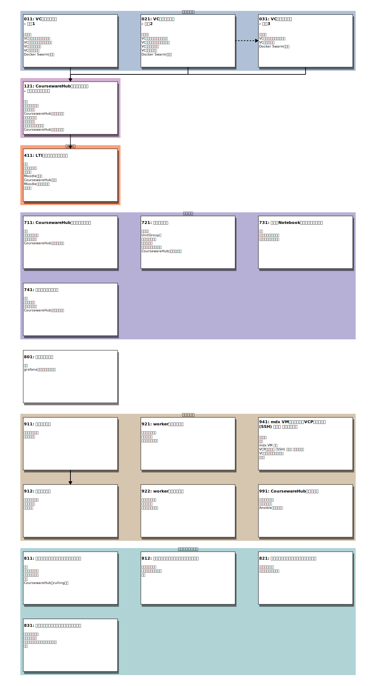

# README

VCP SDKを用いてクラウド上にCoursewareHub環境を構築します。

## はじめに

このアプリケーションテンプレートではVCPで作成したノードに[CoursewareHub](https://github.com/NII-cloud-operation/CoursewareHub-LC_jupyterhub-deploy)環境を構築します。

### CoursewareHubのユーザ認証について

CoursewareHubではユーザの認証機能として以下に示す三つの方式に対応しています。

* ローカルユーザ認証
    * CoursewareHubのローカルユーザデータベースを用いてユーザ管理を行う
* 学認連携に基づく認証
    * [学認](https://www.gakunin.jp/)のSPとして登録し、認証連携を行う
    * CoursewareHubを直接SPとしては登録せずに、プロキシ(IdPプロキシ)を経由して連携することも可能
* LMS(Learning Management System)との認証連携
    * [LTI 1.3](http://www.imsglobal.org/spec/lti/v1p3/)による認証連携を行う
    * アプリケーションテンプレートでは連携するLMSとして[Moodle](https://moodle.org/)を想定している

それぞれの認証機能は共存することが可能になっています。ただし、学認連携認証を用いる場合はコンテナの構成や設定手順が異なります。そのため、それに応じた異なる構築手順を用意しています。

一方 LMSとの認証連携を行う場合は、まずローカルユーザ認証、あるいは学認連携認証の手順でCoursewareHubを構築してください。その後にLMSとの認証連携の設定を追加する手順となっています。

### コンテナの構成について

ローカルユーザ認証のみを用いる場合と、学認連携認証を利用する場合とではコンテナの構成が異なります。ここでは、それぞれのコンテナ構成について記します。

CoursewareHubでは、学認連携の有無、あるいは連携方法の違いにより以下に示す方式を選択することができます。
* ローカルユーザ認証のみを利用する
* 学認フェデレーションに参加し、学認のIdPを利用して認証を行う
    - IdP-proxyをSPとして学認に登録し、複数のCoursewareHubがIdP-proxyを通して学認のIdPを利用する
    - CoursewareHubを直接SPとして学認に登録する
    
それぞれの方式に対応する構成図を以下に示します。
    
#### ローカルユーザ認証のみを利用する場合


#### IdP-proxyを利用する場合


#### CoursewareHubを直接SPとして登録する場合


### ノード構成

CoursewareHubのノードは役割に応じて以下のものに分類されます

* manager
    - JupyterHub, auth-proxy, PostgreSQLなどのSystemコンテナを実行するノード
    - Docker Swarmのmanagerノードとなる
* worker
    - single-user Jupyter notebook serverを実行するノード
    - Docker Swarm の workerノードとなる
    
CoursewareHubではデータやNotebookなどをノード間で共有するためにNFSを利用します。NFSサーバの配置により以下の３つパターン構成が可能となっています。

1. 構成1
    - managerノードにNFSサーバを配置する
1. 構成2
    - managerノードとNFSサーバを別のノードとして構成する
1. 構成3
    - 構成2のNFSサーバに、新たなCoursewareHub環境を追加する構成

#### 構成1

managerノードでNFSサーバを実行します。


#### 構成2

managerノードとNFSサーバを分離し別々のノードとして構築します。


#### 構成3

構成2のNFSサーバに、新たなCoursewareHub環境を追加します。NFSサーバは複数のCoursewareHub環境で共有されます。


### 収容設計について

#### managerノード

* システム用コンテナが実行される
    - auth-proxyコンテナ
    - JupyterHubコンテナ
    - PostgreSQLコンテナ
* ユーザが利用する single-userサーバコンテナは実行されない
* NFSサーバをmanagerノードに共存させる場合（構成１）はディスク容量を適切な値に設定する

#### workerノード

* ユーザが利用するsingle-userコンテナが実行される
* single-userコンテナのリソース量として以下の設定を行っている
    - 最大CPU利用数
    - 最大メモリ量(GB)
    - 保証される最小割当てメモリ量(GB)
* システム全体で必要となるリソース量を見積もるには
    - (コンテナに割り当てるリソース量)×(最大同時使用人数)+(システムが利用するリソース量)×(ノード数)
    
#### 運用例

* 最大同時使用人数
    - 400 人
* コンテナに割り当てるリソース量
    - メモリ最小値保証
        - 1GB
    - メモリ最大値制限
        - 2GB(swap 4GB)
    - CPU最大値制限
        - 200% (2cores)
        
上記の条件で運用を行った際の実績値を示します。

* managerノード
    - vCPU
        - 10
    - memory
        - 16GB
    - HDD
        - 800GB
* workerノード
  - ノードA
    - ノード数
        - 4
    - vCPU
        - 30
    - memory
        - 100GB
    - HDD
        - 300GB
  - ノードB
    - ノード数
        - 1
    - vCPU
        - 20
    - memory
        - 80GB
    - HDD
        - 300GB

> workerノードはリソース量の異なるノードAとノードBで構成されていた。

workerノードのメモリ総量は480GB(=100×4+80)となっていますが、これは以下のように見積もっています。
```
(コンテナのメモリ最小値保証)×(最大同時使用人数)+(システム利用分)
= 1GB × 400人 + 80GB
```

## 事前に準備が必要となるものについて

このアプリケーションテンプレートを実行するにあたって事前に準備が必要となるものについて記します。

### VCノード

ノードを作成するとき必要となるものについて記します。

* VCCアクセストークン
    - VCP SDKを利用してクラウド環境にノード作成などを行うために必要となります
    - VCCアクセストークンがない場合はVC管理者に発行を依頼してください
* SSH公開鍵ペア
    - VCノードに登録するSSHの公開鍵
    - このNotebook環境内で新たに作成するか、事前に作成したものをこの環境にアップロードしておいてください
* VCノードに割り当てるアドレス
    - ノードのネットワークインタフェースに以下に示す何れかのアドレスを指定することができます
        - IPアドレス
        - MACアドレス
* NTPの設定
    - 学認フェデレーションに参加し SAML 認証を利用する場合、正しい時刻設定が必要となります
    - VCノードのNTPサービスを有効にするためには、事前にVCコントローラへの設定が必要となります
    - VCコントローラへの設定にはOCS運用担当者への申請が必要となります

### CoursewareHub

CoursewareHubを構築する際に必要となるものについて記します。

* CoursewareHubのサーバ証明書
    - CoursewareHubではHTTPSでサーバを公開するため、サーバ証明書とその秘密鍵が必要となります
    - 必要に応じて、サーバ証明書の中間CA証明書を準備してください
    - サーバ証明書に記載されているホスト名のDNS登録も必要となります

また事前の段階では不要ですが、学認のIdPを認証に利用する場合は構築手順の過程で
学認フェデレーションに参加の申請を行う必要があります。

### IdP-proxy

IdP-proxy を構築する際に必要となるものについて記します。

* IdP-proxyのサーバ証明書
    - IdP-proxyではHTTPSでサーバを公開するため、サーバ証明書とその秘密鍵が必要となります
    - 必要に応じて、サーバ証明書の中間CA証明書を準備してください
    - サーバ証明書に記載されているホスト名のDNS登録も必要となります

また事前の段階では不要ですが、学認のIdPを認証に利用する場合は構築手順の過程で
学認フェデレーションに参加の申請を行う必要があります。

## Notebookの一覧


### 各Notebookの関連について

テンプレートとなるNotebookの関係を示す図を以下に示します。図に表示される１つのブロックが１つのNotebookに対応しています。

[](images/notebooks0.svg)

次の図はIdP-proxyの構築とそれに関連するCoursewareHubのNotebookの関連を示します。

[](images/notebooks0-idp.svg)

### Notebookの目次

各Notebookの目次を示します。リンクが表示されている項目が一つのNotebookに対応しています。

* [011: VCノードの作成--構成1](notebooks/011-VCノード作成-構成1.ipynb)
    1. はじめに
        - このNotebookではCoursewareHub環境を構築するためのノード作成を行います
    1. VCノードに関するパラメータ
        - CoursewareHubの構築環境となるVCノードに関するパラメータを指定します
    1. VCディスクに関するパラメータ
        - CoursewareHubに関するデータやNotebook、ユーザのホームディレクトリなどに利用するVCディスクに関するパラメータを指定します
    1. VCディスクの作成
        - NFS用のVCディスクを作成します
    1. VCノードの起動

    1. Docker Swarmの設定
        - Docker Swarm の設定を行います
* [021: VCノードの作成--構成2](notebooks/021-VCノード作成-構成2.ipynb)
    1. はじめに
        - このNotebookではCoursewareHub環境を構築するためのノード作成を行います
    1. VCノードに関するパラメータ
        - CoursewareHubの構築環境となるVCノードに関するパラメータを指定します
    1. VCディスクに関するパラメータ
        - CoursewareHubに関するデータやNotebook、ユーザのホームディレクトリなどに利用するVCディスクに関するパラメータを指定します
    1. VCディスクの作成
        - NFS用のVCディスクを作成します
    1. VCノードの起動

    1. Docker Swarmの設定
        - Docker Swarm の設定を行います
* [031: VCノードの作成--構成3](notebooks/031-VCノード作成-構成3.ipynb)
    1. はじめに
        - このNotebookでは構成2で構築したNFSサーバに、新たなCoursewareHub環境を追加するためのノード作成を行います(構成3)
    1. VCノードに関するパラメータ
        - CoursewareHubの構築環境となるVCノードに関するパラメータを指定します
    1. VCノードの起動

    1. Docker Swarmの設定
        - Docker Swarm の設定を行います
* [121: CoursewareHubのセットアップ--ローカルユーザ認証](notebooks/121-CoursewareHubのセットアップ-ローカルユーザ認証.ipynb)
    1. 概要
        - このNotebookで構築するCoursewareHubの構成要素を以下に示します
    1. パラメータの設定

    1. 証明書の配置
        - auth-proxyコンテナで使用するサーバ証明書、秘密鍵などのファイルを配置します
    1. CoursewareHubのセットアップ
        - CoursewareHubを構成するサービスやコンテナのセットアップを行います
    1. コンテナの起動

    1. 管理者の登録
        - CoursewareHubに管理ユーザを登録します
    1. コンテンツの配備の準備
        - CoursewareHubのコンテンツを格納するディレクトリを作成し、コンテンツの配置を行うNotebookを管理者のホームディレクトリに配置します
    1. CoursewareHubにアクセスする
        - 構築したCoursewareHub環境にアクセスして、正しく動作していることを確認してください
* [211: 学認連携の設定を行う -- IdP-proxyを利用する](notebooks/211-学認連携の設定を行う-IdP-proxyを利用する.ipynb)
    1. 概要
        - このNotebookで設定するCoursewareHubと学認フェデレーションの構成要素を以下に示します
    1. mAPグループの作成
        - [学認クラウドゲートウェイサービス](https://cg.gakunin.jp/)にアクセスしてグループの作成などを行います
    1. CoursewareHubの設定
        - CoursewareHubに対して学認連携設定を行います
    1. メタデータの更新
        - 構築したCoursewareHubのメタデータを IdP-proxy に登録するまでは、学認によるログインを利用できません
    1. CoursewareHubに学認IdPのアカウントでログインする
        - 学認IdPのアカウントでCoursewareHubにログインできることを確認します
* [311: 学認連携の設定を行う -- 直接学認フェデレーションを利用する](notebooks/311-学認連携の設定を行う-直接学認フェデレーションを利用する.ipynb)
    1. 概要
        - このNotebookで設定するCoursewareHubと学認フェデレーションの構成要素を以下に示します
    1. mAPグループの作成
        - [学認クラウドゲートウェイサービス](https://cg.gakunin.jp/)またはSP検証環境(テストフェデレーションの場合)にアクセスしてグループの作成などを行います
    1. CoursewareHubの設定
        - CoursewareHubに対して学認連携設定を行います
    1. 学認にSP設置の申請を行う
        - 申請を行う前に学認（GakuNin）の「[参加情報](https://www.gakunin.jp/join)」にてフェデレーション参加の流れを確認してください
    1. 学認mAPとの連携
        - CoursewareHubでは利用者をグループ管理するために[学認mAP](https://meatwiki.nii.ac.jp/confluence/display/gakuninmappublic/Home)を利用します
    1. CoursewareHubに学認IdPのアカウントでログインする
        - 学認IdPのアカウントでCoursewareHubにログインできることを確認します
* [411: LTI認証連携の設定を行う -- Moodle](notebooks/411-LTI認証連携の設定を行う.ipynb)
    1. はじめに

    1. Moodleで外部ツールの設定を行う
        - CoursewareHubとLTI認証連携を行う Moodle にて、外部ツールの設定を行います
    1. CoursewareHubにLTI認証連携設定を行う

    1. MoodleでLTI リンクを作成する
        - MoodleのサイトまたはコースのページにLTIリンクを作成します
* [511: VCノードの作成--IdP-proxy](notebooks/511-VCノード作成-IdP-proxy.ipynb)
    1. はじめに

    1. VCノードに関するパラメータ
        - IdP-Proxyの構築環境となるVCノードに関するパラメータを指定します
    1. VCノードの起動
        - VCノードを起動します
    1. Ansibleの設定
        - VCノードをAnsibleで操作するための設定を行います
* [521: IdP-proxyのセットアップ](notebooks/521-IdP-proxyのセットアップ.ipynb)
    1. はじめに

    1. 操作対象の設定
        - 操作対象となるAnsibleのグループ名を指定します
    1. パラメータの設定

    1. 証明書の配置
        - IdP-proxyで使用するサーバ証明書、秘密鍵などのファイルを配置します
    1. IdP-proxyのセットアップ
        - IdP-proxyコンテナで必要となるファイルを準備する Ansible Playbook を実行します
    1. IdP-proxyコンテナの起動
        - コンテナイメージを取得します
    1. 学認にSP設置の申請を行う
        - 申請を行う前に学認（GakuNin）の「[参加情報](https://www.gakunin.jp/join)」にてフェデレーション参加の流れを確認してください
    1. 学認mAPとの連携
        - CoursewareHubでは利用者グループを管理するために[学認mAP](https://meatwiki.nii.ac.jp/confluence/display/gakuninmappublic/Home)を利用します
* [541: auth-proxyのメタデータを登録する](notebooks/541-IdP-proxyへauth-proxyのメタデータを登録する.ipynb)
    1. 概要
        - このNotebookでは「211-学認連携の設定を行う-IdP-proxyを利用する.ipynb」で設定したauth-proxyコンテナからメタデータを取得してIdP-proxyへの登録を行います
    1. 操作対象の設定
        - 操作対象となるAnsibleのグループ名を指定します
    1. メタデータの追加
        - CoursewareHub(auth-proxy)のメタデータをIdP-proxyに登録します
* [591: IdP-proxyの削除](notebooks/591-IdP-proxyの削除.ipynb)
    1. パラメータの指定

    1. 構築環境の削除
        - 起動したVCノードを削除します
    1. Ansible設定のクリア
        - 削除した環境に対応するAnsibleの設定をクリアします
* [711: CoursewareHubのパラメータ変更](notebooks/711-CoursewareHubのパラメータ変更.ipynb)
    1. 概要

    1. パラメータの更新

    1. コンテナの更新

    1. CoursewareHubにアクセスする
        - パラメータを更新したCoursewareHub環境にアクセスして正しく動作していることを確認してください
* [721: 管理者の追加](notebooks/721-管理者の追加.ipynb)
    1. はじめに
        - このNotebookは、CoursewareHub環境構築の際に誤った管理者情報を登録したなどの理由により、CoursewareHub環境に管理者としてログインできるユーザが存在しないなどの状況を回避するためのものです
    1. UnitGroup名
        - 操作対象となるVCPのUnitGroup名を指定します
    1. パラメータの設定
        - 追加する管理者の情報を指定します
    1. 管理者の追加
        - CoursewareHubに管理ユーザを登録します
    1. コンテンツの配備の準備
        - CoursewareHubのコンテンツを格納するディレクトリを作成し、コンテンツの配置を行うNotebookを管理者のホームディレクトリに配置します
    1. CoursewareHubにアクセスする
        - 追加した管理者ユーザでログインできることを確認してください
* [731: 講義用Notebook環境のイメージ登録](notebooks/731-講義用Notebook環境のイメージ登録.ipynb)
    1. 概要
        - CoursewareHubでは管理ユーザ（講師）が[repo2docker](https://github.com/jupyterhub/repo2docker)を利用して講義用のNotebook実行環境をカスタマイズする機能を備えています
    1. カスタムイメージの定義
        - CoursewareHubで利用する講義用のカスタムイメージについて説明します
    1. カスタムイメージの管理
* [741: サーバ証明書の更新](notebooks/741-サーバ証明書の更新.ipynb)
    1. 概要

    1. 証明書の更新
        - auth-proxyなどのコンテナで使用するサーバ証明書、秘密鍵を更新します
    1. コンテナの更新
        - コンテナを起動しなおして更新したサーバ証明書を反映させます
    1. CoursewareHubにアクセスする
        - 証明書を更新したCoursewareHub環境にアクセスして正しく動作していることを確認してください
* [801: リソース可視化](notebooks/801-リソース可視化.ipynb)
    1. 概要
        - 以下に示す３つのダッシュボードをgrafanaに追加し、CoursewareHub環境のリソース利用状況を可視化します
    1. grafanaダッシュボードの登録
        - VC Controllerに配備されている grafana にダッシュボードを登録します
* [911: ノードの停止](notebooks/911-ノードの停止.ipynb)
    1. パラメータの指定
        - ノードの停止を行うのに必要となるパラメータを入力します
    1. ノードの停止
        - 現在のノードの状態を確認します
* [912: ノードの再開](notebooks/912-ノードの再開.ipynb)
    1. パラメータの指定
        - ノードを再開するのに必要となるパラメータを入力します
    1. ノードの再開
        - 現在のノードの状態を確認します
    1. 状態の確認
        - docker swarmで実行しているサービスの状態を確認します
* [921: workerノードの追加](notebooks/921-workerノードの追加.ipynb)
    1. パラメータの指定
        - workerノードを追加するのに必要となるパラメータを入力します
    1. ノードの追加

    1. 管理者ユーザの設定
        - 構築環境のJupyterHubでは講師権限を持つ管理ユーザが操作を行うためのインベントリファイルが配置されています
* [922: workerノードの削除](notebooks/922-workerノードの削除.ipynb)
    1. パラメータの指定
        - workerノードを削除するのに必要となるパラメータを入力します
    1. ノードの削除

    1. 管理者ユーザの設定
        - 構築環境のJupyterHubでは講師権限を持つ管理ユーザが操作を行うためのインベントリファイルが配置されています
* [941: mdx VMのデプロイとVCP既存サーバ (SSH) モード セットアップ](notebooks/941-mdx仮想マシンの準備.ipynb)
    1. 前提条件
        - 1. VCコントローラが動作していること
    1. 準備
        - 1. mdx REST API 認証トークン設定
    1. mdx VM 作成
        - 1. VCP SDK mdx用プラグインモジュールの読み込み
    1. VCP既存サーバ (SSH) モード セットアップ
        - 1. mdx VMへの疎通確認
    1. VCコントローラ公開鍵設定
        - VCコントローラがmdx VMを既存サーバ(SSH) モードで制御するにはSSH接続を使用します
    1. まとめ
        - ここまでで、mdx VMに対してVCコントローラからSSHでVC Nodeをデプロイ可能な環境の準備が整いました
* [951: ノード電源状態変更スケジュールを設定する--CoursewareHubのmanagerノードを利用する](notebooks/951-workerノードの電源状態変更スケジュールを設定する.ipynb)
    1. 概要
        - このNotebookではCoursewareHubを構成するworkerノードの起動数を、授業日とそれ以外の曜日で変更できるような設定を行います
    1. パラメータの指定
        - ノードの電源操作スケジュールを登録するのに必要となるパラメータを指定します
    1. 資材の配置
        - 電源操作を行うノードに必要となる資材を配置します
    1. タイマーの開始
        - 設定ファイルを配置したsystemdタイマーを開始してノードの電源状態更新処理がスケジュールされるようにします
    1. CoursewareHubのculling設定
        - CoursewareHubを構成するJupyterHubコンテナに環境変数を設定することでculling設定を有効にすることができます
* [952: ノード電源状態変更スケジュールを設定する--CoursewareHub以外のノードを利用する](notebooks/952-workerノードの電源状態変更スケジュールを設定する.ipynb)
    1. 概要
        - このNotebookではCoursewareHubを構成するworkerノードの起動数を、授業日とそれ以外の曜日で変更できるような設定を行います
    1. 電源操作を行うノードの指定
        - 電源操作コンテナを実行するノードを指定します
    1. パラメータの指定
        - ノードの電源操作スケジュールを登録するのに必要となるパラメータを指定します
    1. 資材の配置
        - 電源操作を行うノードに必要となる資材を配置します
    1. タイマーの開始
        - 設定ファイルを配置したsystemdタイマーを開始てノードの電源状態更新処理がスケジュールされるようにします
    1. CoursewareHubのculling設定
        - CoursewareHubを構成するJupyterHubコンテナに環境変数を設定することでculling設定を有効にすることができます
* [953: ノード数を変更するスケジュールを設定する--CoursewareHubのmanagerノードを利用する](notebooks/953-workerノードのノード数を変更するスケジュールを設定する.ipynb)
    1. 概要
        - このNotebookではCoursewareHubを構成するworkerノードの起動数を、授業日とそれ以外の曜日で変更できるような設定を行います
    1. パラメータの指定
        - VCノードのスケールアウト、スケールインを行うのに必要となるパラメータを指定します
    1. 資材の配置
        - ノード操作を行うための資材を配置します
    1. タイマーの開始
        - 設定ファイルを配置したsystemdタイマーを開始してノード数の操作がスケジュールされるようにします
    1. CoursewareHubのculling設定
        - CoursewareHubを構成するJupyterHubコンテナに環境変数を設定することでculling設定を有効にすることができます
* [954: ノード数を変更するスケジュールを設定する--CoursewareHub以外のノードを利用する](notebooks/954-workerノードのノード数を変更するスケジュールを設定する.ipynb)
    1. 概要
        - このNotebookではCoursewareHubを構成するworkerノードの起動数を、授業日とそれ以外の曜日で変更できるような設定を行います
    1. ノード操作を行う環境の指定
        - ノード操作コンテナを実行する環境を指定します
    1. パラメータの指定
        - ノードの電源操作スケジュールを登録するのに必要となるパラメータを指定します
    1. 資材の配置
        - 電源操作を行うノードに必要となる資材を配置します
    1. タイマーの開始
        - 設定ファイルを配置したsystemdタイマーを開始してノードの更新処理がスケジュールされるようにします
    1. CoursewareHubのculling設定
        - CoursewareHubを構成するJupyterHubコンテナに環境変数を設定することでculling設定を有効にすることができます
* [955: ノード操作のスケジュールを変更する](notebooks/955-workerノード操作のスケジュールを変更する.ipynb)
    1. ノード操作を行う環境の指定
        - VCノード操作コンテナを実行する環境のansibleグループを指定します
    1. パラメータの指定
        - VCノードのスケジュールを設定するのに必要となるパラメータを指定します
    1. 設定ファイルの配置
        - workerノード状態の設定スケジュールを記した設定ファイル`schedule.json`を配置します
* [956: ノード操作のスケジュールを削除する](notebooks/956-workerノード操作のスケジュールを削除する.ipynb)
    1. ノード操作を行う環境の指定
        - VCノード操作コンテナを実行する環境のansibleグループを指定します
    1. スケジュール設定の停止

* [991: CoursewareHub環境の削除](notebooks/991-CoursewareHub環境の削除.ipynb)
    1. パラメータの指定

    1. 構築環境の削除

    1. Ansible設定のクリア
        - 削除した環境に対応するAnsibleの設定をクリアします