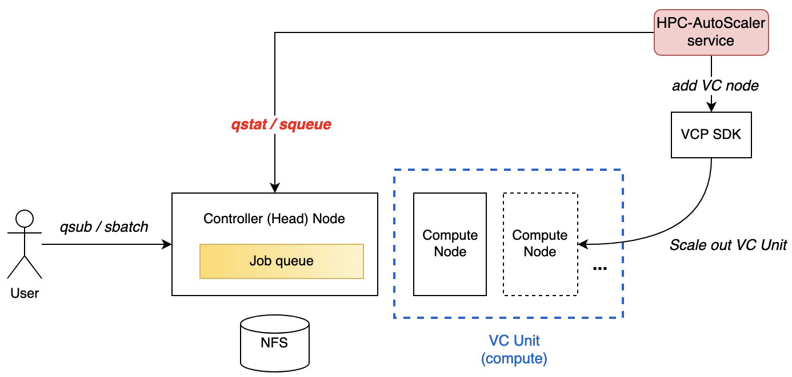

# 計算資源補完のためのテンプレート

## 概要

オンプレミスのバッチ型計算機システムの計算ノードが不足したとき、クラウド上に
オンプレミスシステムと同様のソフトウェア構成を持つ計算ノードを立ち上げ、
既存のバッチシステムに組み込むことを想定した実装である。

以下の要件に対応する。

- インターフェースを抽象化し、複数種のバッチシステムに適用可能とする。
- 適用対象のバッチシステムは、（当面は） SLURM および Torque を想定する。
- 構築するクラウド上の計算ノードのソフトウェア環境は、オンプレミスと同じ
  ソフトウェア環境の VM イメージもしくはコンテナの利用を前提とする。
- 開発時点での動作確認済みの環境：
	* クラウドプロバイダ: AWS, Azure, mdx
	* バッチシステム: SLURM
	* ファイル共有: NFS



## 機能仕様

### Hybrid Cloud Service のメイン制御

Hybrid Cloud Service は常駐プロセスとして起動し、特定のジョブキューに対する
実行状況を定期的にジョブ管理システムに問い合わせる。

1. キューのジョブ実行状況を確認し、実行待ちジョブが1個以上あれば1ノードを追加する。
2. 実行待ちジョブが1個も無い場合、 `CLEANUP_NODE_WAIT_TIME` 秒間だけ待機する。
3. 再度ジョブ実行状況を確認し、実行待ち、実行中ジョブがどちらも無い場合、
   1ノードを削除する。
4. 再度、1 の処理から繰り返す。

### VCP SDK を用いたノード追加、削除

Hybrid Cloud Service のメイン制御から呼ばれる VCP SDK を用いたノードの追加、削除
処理は、Docker コンテナ化された VCP SDK API を呼び出す方式で実行する。

#### ノード追加

- VCP SDK を使用し、環境変数 `VC_GROUP_NAME` および `VC_UNIT_NAME` に指定した Unit に対して VC Node 1 個を追加 (add_nodes) する。
- VC Node の spec は [OpenHPC v2 テンプレート](https://github.com/nii-gakunin-cloud/ocs-templates/tree/master/OpenHPC-v2)  で作成済みの Unit の spec が適用される。

#### ノード削除

- VCP SDK を使用し、環境変数 `VC_GROUP_NAME` および `VC_UNIT_NAME` に指定した Unit に対して VC Node 1 個を削除 (delete_nodes) する。
- [OpenHPC v2 テンプレート](https://github.com/nii-gakunin-cloud/ocs-templates/tree/master/OpenHPC-v2) で作成された1個目の計算ノードについては削除しない。

### バッチシステムとのインターフェース

バッチシステムによりジョブキューのノード実行状況を問い合わせするコマンドや、
その出力内容は異なる。このため、Hybrid Cloud Service のメイン制御部から呼び出す
コマンドとして、バッチシステムごとに以下の Base スクリプト関数を実装する。

| 関数名        | 目的                   |
| ------------- |----------------------- |
| get_status    | キューのノード実行状況を取得し、実行待ちまはた実行中ジョブの個数を集計する |
| join_cluster  | 起動したノードでジョブを実行可能な状態にする |
| leave_cluster | シャットダウンするノードをクラスタから切り離す |
| check_version | 使用するジョブ管理コマンドが実行可能かどうかを確認する |


各関数の処理内容は、SLURM を例とした場合には以下のようになる。

**get_status**

1. `squeue` コマンドの実行結果を取得

    ```
    # e.g. squeue コマンド実行時出力:
    JOBID PARTITION     NAME     USER ST       TIME  NODES NODELIST(REASON)
       18     cloud   run.sh   ubuntu PD       0:00      1 (Resources)
       21     xxxxx   run.sh   ubuntu  R       0:00      1 (Priority)
       19     cloud   run.sh   ubuntu PD       0:00      1 (Priority)
       20     cloud   run.sh   ubuntu PD       0:00      1 (Priority)
       17     cloud   run.sh   ubuntu  R       0:50      1 c1
    ```

2. ジョブ実行待ち、実行中に対応する JOB STATE CODES を集計する。  
   SLURM の場合、PD=PENDING, R=RUNNING である。

    ```
    # e.g. squeue コマンド出力結果の集計:
    3 PD
    1 R
    ```
    
**join_cluster**

- 起動したノードの状態を "IDLE" 状態に更新する。
  * SLURM の場合、コントローラが当該ノードを計算ノードとして利用可能な状態になったことを
    検知するまでに数分程度を要するため、 `scontrol update` コマンドを用いて状態を強制的に
    更新する。

    ```
    sudo scontrol update node=$nodename state=idle
    ```

  * 利用するバッチシステムにより、この処理の要否は異なる。

**leave_cluster**

- シャットダウンするノードの状態を "DRAIN" 状態に更新する。
  * SLURM の場合、コントローラが当該ノードの停止を検知するまでに数分程度を要するため、
    `scontrol update` コマンドを用いて状態を強制的に更新する。

    ```
    sudo scontrol update node=$nodename state=drain reason=downing
    ```

  * 利用するバッチシステムにより、この処理の要否は異なる。

## 利用手順

### 環境変数設定

#### Required

設定ファイル `vcpsdk/config/env`  を記述する。 `docker.env.example` を参考のこと。

- `VCP_ACCESSKEY`
	- VCP REST API アクセストークン
- `VCP_CONFIG_DIR`
	- VCP SDKコンテナ内における VCP 設定ファイルのパス
	-  設定例: `/vcp_config`
- `SSH_PUBLIC_KEY_PATH`
	- mdx VMのデプロイで使用するSSH公開鍵ファイル
	- 設定例: `/vcp_config/.ssh/id_ed25519.pub`
- `SSH_PRIVATE_KEY_PATH`
	- mdx VMのデプロイで使用するSSH秘密鍵ファイル
	- 設定例: `/vcp_config/.ssh/id_ed25519`
- `VC_PROVIDER`
	- VCPクラウドプラグイン名 (mdx利用時は `onpremises`)
- `VC_FLAVOR`
	- VCP Flavor 名 (mdx利用時は `default`)
- `VC_GROUP_NAME`
	- 計算ノードの VCP Unit Group 名 (例: `OpenHPC`)
- `VC_UNIT_NAME`
	- 計算ノードの VCP Unit 名 (例: `compute`)
- `VC_IMAGE`
	- 計算ノードのDockerイメージ名
	- `harbor.vcloud.nii.ac.jp/vcp/openhpc:compute-2.6`
- `MDX_API_TOKEN`
	- mdx REST API トークン
- `MDX_PROJECT_NAME`
	- mdx のプロジェクト名
- `MDX_PACK_NUM`
	- mdx VM の [CPUパック数](https://docs.mdx.jp/ja/main/create_vm.html#deploy-settings)
- `MDX_DISK_SIZE`
	- mdx VM の[仮想ディスクサイズ (GB)](https://docs.mdx.jp/ja/main/create_vm.html#deploy-settings)
- `MDX_INIT_PASSWORD`
	- mdx VM に設定する初期ログインパスワード
- `MDX_USER_NAME`
	- mdx VMのログインユーザ名 (mdx提供のUbuntu VMテンプレートは `mdxuser`)

#### Optional

`scripts/hybrid-cloud-agent.sh`  にデフォルト値が設定されている。

- `CLEANUP_NODE_WAIT_TIME`
	- 実行待ち、実行中ジョブが無い場合に全ノードを削除するまでに待機する時間 (単位: 秒)
	- デフォルト値: `600`
- `VCP_SDK_CONTAINER_IMAGE`
	- VC ノード追加・削除のために使用されるコンテナ化された VCP SDK のイメージ名
	- デフォルト値: `harbor.vcloud.nii.ac.jp/vcpsdk/vcpsdk:22.10.0`
- `QUEUE_NAME`
	- バッチシステムのクラウド専用ジョブキューの名前 (SLURM PARTITION 名、Torque QUEUE 名に対応)
	-  デフォルト値: `normal`

### 計算ノードのホスト名解決ファイル作成

使用する計算ノードの「IP アドレス:ホスト名」のペアを設定ファイルに記述する。

- 設定ファイル (JSON形式) : `vcpsdk/config/hosts.json`
- 先頭エントリの計算ノードは [OpenHPC v2 テンプレート](https://github.com/nii-gakunin-cloud/ocs-templates/tree/master/OpenHPC-v2) を使用して作成し、本機能での追加・削除の対象外となる。

hosts.json 記述例:

```
{
  "172.30.2.101": "c1",
  "172.30.2.102": "c2",
  "172.30.2.103": "c3",
  "172.30.2.104": "c4"
}
```

### VCP SDK Docker コンテナ作成

1. `./vcpsdk/` ディレクトリ直下に VC コントローラの証明書ファイル
  `vcp_ca.crt` を配置する。

2. docker build コマンドを実行する。
    * (注) コンテナ内には config ディレクトリ以下の設定ファイル群は含めないこと。

    ```
    docker build -t vcpsdk:22.10.0 .
    ```

### Hybrid Cloud Service 起動、停止方法

1. systemd 設定

    ```
    cp scripts/hybrid-cloud.service /etc/systemd/system/
    systemctl enable hybrid-cloud
    ```

2. サービス起動

    ```
    systemctl start hybrid-cloud
    ```

3. サービス停止

    ```
    systemctl stop hybrid-cloud
    ```

###  OpenHPC v2 テンプレートによる初期構築の変更点

 [OpenHPC v2 テンプレート](https://github.com/nii-gakunin-cloud/ocs-templates/tree/master/OpenHPC-v2) を用いて初期構築を行う際、次の2つのNotebookについて一部修正した上で実行する必要がある。

- 010-パラメータ設定
- 020-OpenHPCの起動

#### 010-パラメータ設定.ipynb

Slurmクラスタで使用する予定のすべての計算ノード（ホスト名）を slurm.conf に記述しておく。

**7 Slurm**  
**7.2 slurm.conf**

```
slurm_conf = {
    'NodeName': f'{c_hostname_prefix}[1-4]',
#    'NodeName': f'{c_hostname_prefix}[1-{compute_nodes}]' if compute_nodes > 1 else f'{c_hostname_prefix}1',
}
```

#### 020-OpenHPCの起動

計算ノードのホスト名解決ファイルにSlurmクラスタで使用する予定のすべての計算ノードが登録されるように VC Unit の spec を設定する。

**4 VCノードの起動**  
**4.2 マスターノード**  
**4.2.1 specを指定する**  

```
...
# spec_master.add_host = spec_add_host_list(gvars) → コメントアウト

compute_etc_hosts = {
  "10.26.0.90": "hc-c1",
  "10.26.0.91": "hc-c2",
  "10.26.0.92": "hc-c3",
  "10.26.0.93": "hc-c4"
}

add_hosts = [f'{gvars["master_hostname"]}:{gvars["master_ipaddress"]}']
add_hosts.extend([f'{v}:{k}' for k, v in compute_etc_hosts.items()])
spec_master.add_host = add_hosts
```

**4.3 計算ノード**  
**4.3.1 specを指定する**

```
...
# spec_compute.add_host = spec_add_host_list(gvars) → コメントアウト

compute_etc_hosts = {
  "10.26.0.90": "hc-c1",
  "10.26.0.91": "hc-c2",
  "10.26.0.92": "hc-c3",
  "10.26.0.93": "hc-c4"
}

add_hosts = [f'{gvars["master_hostname"]}:{gvars["master_ipaddress"]}']
add_hosts.extend([f'{v}:{k}' for k, v in compute_etc_hosts.items()])
spec_compute.add_host = add_hosts
```
