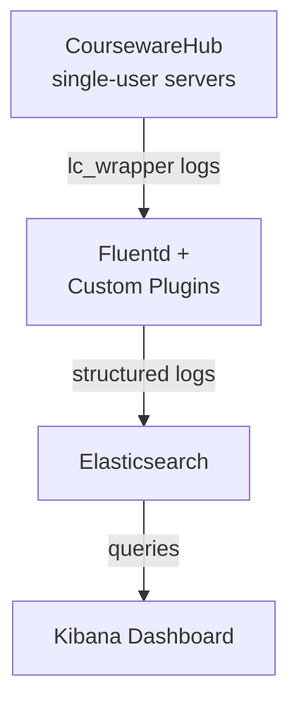

# LogAnalysis

## 概要

このディレクトリは、各種アプリケーションテンプレートで構築された環境から出力されるログを収集・解析・可視化するためのツールや設定手順をまとめたものです。

現在はCoursewareHub環境を対象とし、Jupyter Notebook環境のlc_wrapper（Jupyter-LC_wrapper）が出力する実行ログを扱います。以下の技術スタックを使用します：

- **Fluentd**: ログの収集・構造化・転送
- **Elasticsearch**: ログデータの蓄積・検索
- **Kibana**: ログデータの可視化・分析

CoursewareHub環境では、notebookセルに付与されるMEME IDを活用して、各受講者のnotebook実行状況を詳細に追跡・分析し、学習活動の可視化を支援します。今後は他のアプリケーションテンプレートで出力される各種ログ（アプリケーション固有のログやシステムログ等）への対応拡張を予定しています。

## アーキテクチャ

### システム構成

### データフロー

1. **ログ生成**: CoursewareHubのsingle-userサーバでnotebookセル実行時にlc_wrapperがログを出力
2. **ログ収集**: Fluentdがlc_wrapperログを収集し、カスタムプラグインで構造化・情報付加
3. **データ蓄積**: 処理されたログをElasticsearchに送信・保存
4. **可視化**: Kibanaでダッシュボードを作成し、ユーザ別・セル別の実行状況を可視化

### カスタムFluentdプラグイン

本テンプレートでは、ログ解析に特化した以下のカスタムプラグインを提供します：

- `fluent-plugin-lc-wrapper`: LC_wrapperログの構造化
- `fluent-plugin-attach-file`: セル実行結果ファイルの添付
- `fluent-plugin-related-info`: 外部情報（ユーザ情報等）の付加
- `memeid-extractor`: MEME IDの抽出・処理

## notebook一覧

### [201-CoursewareHub-notebook実行状況の可視化.ipynb](notebooks/201-CoursewareHub-notebook実行状況の可視化.ipynb)

CoursewareHub環境のlc_wrapperログを収集・可視化するメインのnotebookです。

**主な機能:**
- lc_wrapperログの収集・処理設定
- MEME IDの収集と通し番号の割り当て
- ユーザ情報の付加（アカウント名、UID等）
- Elasticsearchインデックステンプレートの設定
- Kibanaデータビューの登録
- 可視化ダッシュボードの作成

**出力される可視化:**
- ヒートマップ: ユーザ別・セル別の実行回数表示
- 積み上げ棒グラフ: ユーザ別の実行セル数表示

### [801-検証用Elasticsearch,Kibanaの構築.ipynb](notebooks/801-検証用Elasticsearch,Kibanaの構築.ipynb)

検証用の簡易Elasticスタック環境を構築するnotebookです。

**特徴:**
- 1ノード構成のElasticsearch/Kibana
- 認証機能無効（セキュリティ設定なし）
- Docker Composeによるコンテナベース構築
- 検証・テスト用途に最適化

## 利用手順

機能確認を行うために検証環境から始めることを推奨します。

### 前提条件

検証・実運用いずれの場合でも、以下の条件が必要です：

- **CoursewareHub環境**: 稼働中のCoursewareHub環境
- **single-userサーバ**: lc_wrapper（Jupyter-LC_wrapper）が有効化されていること
- **CoursewareHub実行環境**: Fluentdがインストール・設定されていること
  - 注記: OCSテンプレートで構築したCoursewareHubでは自動的にこの条件を満たします

### 検証での利用手順

機能テストや設定検証を行う場合の手順です。

**追加前提条件（検証用Elasticsearch/Kibana環境の構築に必要）:**
- Docker Engine、Docker Composeが利用可能
- 十分なリソース（メモリ4GB以上推奨）
- ネットワークポート（9200, 5601）が利用可能

**手順:**

1. **検証用Elasticsearch/Kibana環境の構築**
   - `801-検証用Elasticsearch,Kibanaの構築.ipynb`を実行
   - シングルノード構成のElasticsearch/Kibanaを構築（認証なし）

2. **ログ分析機能の検証**
   - `201-CoursewareHub-notebook実行状況の可視化.ipynb`を実行
   - 検証環境への接続パラメータを設定
   - サンプルデータでの動作確認

3. **機能確認とテスト**
   - Fluentdプラグインの動作テスト
   - Elasticsearch/Kibanaの設定確認
   - ダッシュボード表示の検証

### 実運用での利用手順

CoursewareHub環境の本格的なログ分析を行う場合の手順です。

**追加前提条件:**
- **Elasticsearch/Kibana環境**: 本番用クラスタ（認証設定有効）へのアクセス権

**手順:**

1. **201-notebookの実行**
   - `201-CoursewareHub-notebook実行状況の可視化.ipynb`を実行
   - 本番Elasticsearch/Kibana環境への接続パラメータ設定
   - 認証情報（ユーザー名、パスワード等）の設定
   - Fluentd設定の配備
   - カスタムプラグインの展開
   - Elasticsearch インデックステンプレートの設定

2. **可視化設定と運用開始**
   - Kibanaデータビューの登録
   - ダッシュボードの作成・設定
   - リアルタイム監視の開始
   - 受講者の学習進捗状況の分析

### 検証から実運用への移行

検証環境で機能確認を完了した後、実運用環境に移行する際の手順です。

**移行手順:**

1. **201-notebookの実行**
   - `201-CoursewareHub-notebook実行状況の可視化.ipynb`を開く
   - 接続パラメータを本番環境用に変更（Elasticsearch/KibanaのURL等）
   - 認証情報（ユーザー名、パスワード、APIキー等）を設定
   - Fluentd設定の配備

2. **本番環境での動作確認**
   - 接続テストの実行
   - データ投入・可視化の動作確認

**実運用Elasticsearch/Kibana環境:**

実運用を行う際に利用するElasticsearch/Kibana環境では、以下の要件を備えた環境を推奨します:

- **認証・セキュリティ**: 認証機能の有効化、適切なユーザー権限管理、セキュリティ設定の実装
- **通信暗号化**: HTTPS/TLS通信による暗号化、適切な証明書管理
- **冗長性・可用性**: マルチノードクラスタ構成による高可用性、障害時の自動復旧機能
- **処理性能・スケーラビリティ**: 大量ログデータ処理に対応した十分なリソース、適切なインデックス設計とパフォーマンス調整

## 参考資料

- [Jupyter-LC_wrapper](https://github.com/NII-cloud-operation/Jupyter-LC_wrapper) - notebook実行ログ収集ツール
- [CoursewareHub テンプレート](../CoursewareHub/) - 対象となる学習環境
- [Elasticsearch](https://www.elastic.co/elasticsearch)
- [Kibana](https://www.elastic.co/kibana)
- [Fluentd公式ドキュメント](https://docs.fluentd.org/)