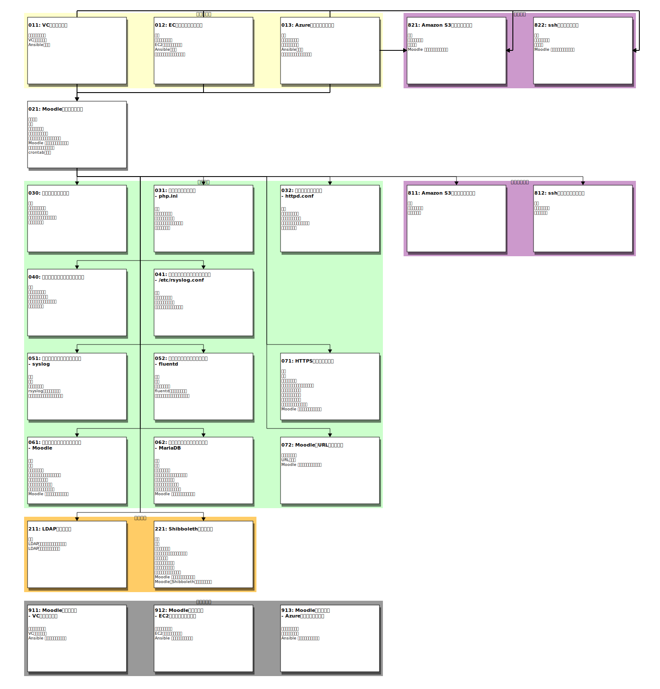

# README

---

Moodle環境の構築を行います。

## 構成について

### コンテナ構成

このアプリケーションテンプレートではDockerコンテナを用いて[Moodle](https://moodle.org/)環境の構築を行います。
構築する環境は次の２つのコンテナで構成されます。

* Moodle
  - MoodleのPHPスクリプトを実行するコンテナ
* [MariaDB](https://hub.docker.com/_/mariadb/)
  - Moodleの設定を保存するデータベース

ここでは小規模構成を想定して２つのコンテナを１つのノードに配置する構成とします。

### リバースプロキシ

Moodle環境へのアクセスをリバースプロキシを経由するように構成することが可能です。ただし、リバースプロキシの構築自体についてはこのアプリケーションテンプレートの対象外となります。

### HTTPS接続

デフォルトの構成ではMoodleコンテナへの接続はHTTPとなっています。HTTPS接続に対応したhttpdコンテナを追加することでMoodleをHTTPSで公開することができます。

HTTPS接続でのMoodle環境を構築するには、まずHTTP接続構成で構築する「021-Moodleコンテナの起動.ipynb」を実行した後に「071-HTTPS接続に変更する.ipynb」を実行してください。

## 準備事項

このアプリケーションテンプレートを実行する前に、必要となる準備事項について記します。

### 仮想マシン作成に必要となるもの

このアプリケーションテンプレートではMoodle環境を構築するための仮想マシンの作成に以下の３つの方法を選択できます。

1. VCP SDKを利用する
1. Amazon EC2インスタンスを利用する
1. Azure仮想マシンを利用する

どの方法を選択するかによって準備するものが異なります。

#### VCP SDKを利用する場合

* VCP SDKのセットアップ
* VC Controllerのアクセストークン

#### Amazon EC2インスタンスを利用する場合

* Amazon のクレデンシャル（アクセスキー、シークレットキー）
* Amazon VPCとサブネットが作成済であること
* EC2キーペアが作成済であること

#### Azure 仮想マシンを利用する場合

* Azureのサービスプリンシパル（サブスクリプションID、 テナントID、クライアントID、シークレット）
* 仮想ネットワーク、サブネットが作成済であること

#### 共通で必要となるもの

* アプリケーションテンプレートで作成した仮想マシンにSSH公開鍵認証でログインするための公開鍵、秘密鍵

### Moodle環境構築に必要となるもの

* Moodleを公開するときのURL
* リバースプロキシに関する情報（リバースプロキシを利用する場合）
* サーバ証明書(HTTPS接続で公開する場合)

## Notebookの一覧

お手本Notebookの一覧を示します。

**注意**:

この節ではお手本Notebookへのリンクを示す箇所がありますが、リンク先のNotebookは参照用となっていて**そのままでは実行できません**。

> Notebook自体は実行できてしまいますが、パスなどが想定しているものと異なるため正しく処理できずエラーとなります。

次のどちらかの手順で作業用Notebookを作成する必要があります。

1. [000-README.ipynb#作業用Notebookの作成](000-README.ipynb#作業用Notebookの作成)で作業用のNotebookを作成する。
1. お手本Notebookを配置してある `notebooks/` から、`README.md`と同じディレクトリにNotebookをコピーする。

### 各Notebookの関連について

各お手本Notebookの関係を示す図を以下に示します。図に表示される１つのブロックが１つのNotebookに対応しています。

### Notebookの目次

各お手本Notebookの目次を示します。リンクが表示されている項目が一つのNotebookに対応しています。

* [011:  VCノードの作成](notebooks/011-VCノードの作成.ipynb)
    1. パラメータの設定
        - VCノードを作成するために必要となるパラメータを指定します
    1. VCノードの作成
        - VCP SDK を利用してVCノードを作成します
    1. Ansibleの設定
        - VCノードをAnsibleで操作するための設定を行います
* [012:  ECインスタンスの作成](notebooks/012-EC2インスタンスの作成.ipynb)
    1. 概要

    1. パラメータの設定
        - このNotebookで作成するAWS EC2インスタンスのパラメータを設定します
    1. EC2インスタンスの作成
        - これまでに入力したパラメータを指定したEC2インスタンスを作成します
    1. Ansibleの設定
        - 起動したEC2インスタンスをAnsibleで操作するための設定を行います
    1. パッケージなどのインストール
        - Moodle環境を構築する際に必要となるパッケージなどのインストールを行います
* [013:  Azure仮想マシンの作成](notebooks/013-Azure仮想マシンの作成.ipynb)
    1. 概要

    1. パラメータの設定
        - このNotebookで作成するAzure仮想マシンのパラメータを設定します
    1. 仮想マシンの作成
        - これまでに入力したパラメータに従いAzureの仮想マシンを作成します
    1. Ansibleの設定
        - 起動した仮想マシンをAnsibleで操作するための設定を行います
    1. パッケージなどのインストール
        - Moodle環境を構築する際に必要となるパッケージなどのインストールを行います
* [021:  Moodleコンテナの起動](notebooks/021-Moodleコンテナの起動.ipynb)
    1. 全体構成

    1. 準備

    1. パラメータ設定

    1. 設定ファイルの配置
        - Moodleコンテナ、DBコンテナを実行するのに必要となる設定ファイルを構築環境に配置します
    1. アプリケーションコンテナの起動
        - Moodleコンテナ、データベースコンテナを起動して、Moodle環境を起動します
    1. Moodle を利用できることを確認
        - 構築したMoodle環境にアクセスし、Moodle が利用できることを確認します
    1. コンテナのログを確認する
        - MoodleコンテナのApache HTTP Serverのログはホスト環境の `/var/log/httpd/` に出力されます
    1. crontabの設定
        - Moodleのスケジュールタスクを実行するために必要となるスクリプトを1分毎に実行するように crontab を設定します
* [030:  設定ファイルの変更](notebooks/030-設定ファイルの変更.ipynb)
    1. 概要
        - 構築したMoodle環境では利用者が変更する可能性のある `php.ini` などの設定ファイルをコンテナではなくホスト環境に配置しています
    1. パラメータの設定
        - 変更対象のコンテナ名、設定ファイル名などを指定します
    1. 設定ファイルの編集
        - コンテナの設定ファイルをローカル環境に取得して、Jupyter Notebookの編集機能を用いて設定ファイルを編集します
    1. 編集した設定ファイルの反映
        - 編集したファイルをホスト環境に配置して、設定ファイルの変更内容をコンテナに反映させます
    1. 変更を取り消す
        - 編集前の設定ファイルの状態に戻します
* [031:  設定ファイルの変更--php.ini](notebooks/031-設定ファイルの変更.ipynb)
    1. 概要
        - 設定ファイルを変更する例としてMoodleコンテナの `php.ini` に設定されている `upload_max_filesize`, `post_max_size` の値を変更してみます
    1. パラメータの設定
        - 変更対象のコンテナ名、設定ファイル名などを指定します
    1. 設定ファイルの編集
        - Moodleコンテナの設定ファイル`php.ini`をローカル環境に取得しJupyter Notebookの編集機能を用いて編集します
    1. 編集した設定ファイルの反映
        - 編集したファイルをホスト環境に配置して、設定ファイルの変更内容をコンテナに反映させます
    1. 変更を取り消す
        - 編集前の設定ファイルの状態に戻します
* [032:  設定ファイルの変更--httpd.conf](notebooks/032-設定ファイルの変更.ipynb)
    1. 概要
        - 設定ファイルを変更する例としてMoodleコンテナのApache HTTPサーバの設定ファイルを編集して、起動時のサーバプロセス数を変更してみます
    1. パラメータの設定
        - 変更対象のコンテナ名、設定ファイル名などを指定します
    1. 設定ファイルの編集
        - Moodleコンテナの設定ファイルをローカル環境に取得しJupyter Notebookの編集機能を用いて設定ファイルを編集します
    1. 編集した設定ファイルの反映
        - 編集したファイルをホスト環境に配置して、設定ファイルの変更内容をコンテナに反映させます
    1. 変更を取り消す
        - 編集前の設定ファイルの状態に戻します
* [040:  ホスト環境の設定ファイル変更](notebooks/040-ホスト環境の設定ファイル変更.ipynb)
    1. 概要
        - 構築環境のホスト側の `/etc/` などに配置されている設定ファイルを編集する手順を示します
    1. パラメータの指定

    1. 設定ファイルの編集
        - 設定ファイルをローカル環境に取得して、Jupyter Notebookの編集機能を用いて設定ファイルを編集します
    1. 編集した設定ファイルの配置
        - 編集したファイルを構築環境に配置します
    1. 変更を取り消す
        - 編集前のファイルを構築環境に配置して、もとの設定に戻します
* [041:  ホスト環境の設定ファイル変更--/etc/rsyslog.conf](notebooks/041-ホスト環境の設定ファイル変更.ipynb)
    1. 概要
        - 構築環境のホスト側の `/etc/rsyslog.conf` の設定を変更する手順を示します
    1. パラメータの指定

    1. 設定ファイルの編集
        - 設定ファイルをローカル環境に取得して、Jupyter Notebookの編集機能を用いて設定ファイルを編集します
    1. 編集した設定ファイルの反映
        - 編集したファイルを構築環境に配置して、設定ファイルの変更内容を反映させます
* [051:  ロギングドライバを変更する--syslog](notebooks/051-ロギングドライバを変更する.ipynb)
    1. 概要
        - Dockerコンテナのロギングドライバを`syslog` に変更して、ログを他ホストのsyslogに転送するように設定します
    1. 準備

    1. パラメータ設定

    1. rsyslogの設定を変更する

    1. コンテナのロギング設定を変更する
        - コンテナのログをsyslogで転送するための構成変更を行います
* [052:  ロギングドライバを変更する--fluentd](notebooks/052-ロギングドライバを変更する.ipynb)
    1. 概要
        - VCノードとして起動したノードではfluentdがサービスとして実行されています
    1. 準備

    1. パラメータ設定

    1. fluentdの設定を変更する

    1. コンテナのロギング設定を変更する
        - コンテナのログをfluentdに転送するための構成変更を行います
* [061:  コンテナイメージを更新する -- Moodle](notebooks/061-コンテナイメージを更新する.ipynb)
    1. 概要
        - Moodleのコンテナイメージを更新します
    1. 準備

    1. パラメータ設定

    1. メンテナンスモードへの切り替え
        - コンテナを停止するので、Moodleをメンテナンスモードに切り替えます
    1. 設定ファイルの配置
        - 新しいコンテナイメージから設定ファイルをコピーしてホスト環境に配置します
    1. コンテナイメージの更新
        - moodleコンテナのイメージ指定を更新した`compose.yaml`を配置して、新しいコンテナの起動を行います
    1. メンテナンスモードの解除
        - 設定変更が完了したのでメンテナンスモードを解除します
    1. Moodle を利用できることを確認
        - Moodle環境にアクセスして利用可能であることを確認します
* [062:  コンテナイメージを更新する -- MariaDB](notebooks/062-コンテナイメージを更新する.ipynb)
    1. 概要
        - MariaDBのコンテナイメージを更新します
    1. 準備

    1. パラメータ設定

    1. メンテナンスモードへの切り替え
        - MariaDBコンテナを停止するので、Moodleをメンテナンスモードに切り替えます
    1. 設定ファイルの配置
        - 新しいコンテナイメージから設定ファイルをコピーしてホスト環境に配置します
    1. コンテナイメージの更新
        - dbコンテナのイメージ指定を更新した`compose.yaml`を配置して、新しいコンテナの起動を行います
    1. メンテナンスモードの解除
        - 設定変更が完了したのでメンテナンスモードを解除します
    1. Moodle を利用できることを確認
        - Moodle環境にアクセスして利用可能であることを確認します
* [071:  HTTPS接続に変更する](notebooks/071-HTTPS接続に変更する.ipynb)
    1. 概要
        - 「021-Moodleコンテナの起動.ipynb」で構築した環境ではMoodleにHTTP(80)で接続する設定となっています
    1. 準備

    1. パラメータ設定

    1. メンテナンスモードへの切り替え
        - Moodleコンテナが一時停止することになるので、メンテナンスモードに切り替えます
    1. サーバ証明書の配置
        - httpdコンテナで使用するサーバ証明書を配置します
    1. 設定ファイルの配置
        - httpdコンテナで実行するApache HTTP serverの設定ファイルを構築環境のホスト側に配置します
    1. コンテナ構成の変更
        - MoodleをHTTPSで公開するためのApache HTTP Serverのコンテナを追加する構成変更を行います
    1. メンテナンスモードの解除
        - 設定変更が完了したのでメンテナンスモードを解除します
    1. Moodle を利用できることを確認
        - Moodle環境にアクセスして利用可能であることを確認します
* [072:  MoodleのURLを変更する](notebooks/072-MoodleのURLを変更する.ipynb)
    1. パラメータ設定

    1. URLの変更
        - Moodleコンテナを新しく指定されたURLで起動し直します
* [211:  LDAP認証の設定](notebooks/211-LDAP認証の設定.ipynb)
    1. 概要

    1. LDAPサーバに接続するための設定
        - LDAPサーバに接続するために必要となる設定を行います
    1. LDAP認証プラグインの設定
        - MoodleでLDAP認証行うための設定を行います
* [221:  Shibboleth認証の設定](notebooks/221-Shibboleth認証の設定.ipynb)
    1. 概要
        - 「021-Moodleコンテナの起動.ipynb」で構築したMoodle環境をShibbolethと連携して認証が行えるように設定します
    1. 準備

    1. パラメータ設定

    1. メンテナンスモードへの切り替え
        - 設定を行う際にMoodleコンテナを一時停止することになるので、メンテナンスモードに切り替えます
    1. 証明書の配置
        - Shibbolethコンテナが使用する証明書、秘密鍵を配置します
    1. 設定ファイルの配置
        - Shibbolethコンテナで実行する Apache HTTP server と Shibboleth SP の設定ファイルを構築環境のホスト側に配置します
    1. コンテナ構成の変更
        - MoodleとShibboleth SPが連携できるようにするようコンテナ構成を変更します
    1. メンテナンスモードの解除
        - 設定変更が完了したのでメンテナンスモードを解除します
    1. Moodle を利用できることを確認
        - Moodle環境にアクセスして利用可能であることを確認します
    1. MoodleのShibbolethプラグインの設定
        - MoodleのShibboleth認証を利用できるようにする設定を行います
* [811:  Amazon S3へのバックアップ](notebooks/811-AmazonS3へのバックアップ.ipynb)
    1. 概要
        - アプリケーションテンプレートで構築したMoodle環境のバックアップを作成し Amazon S3 に保存します
    1. パラメータ設定

    1. バックアップ

* [812:  sshによるバックアップ](notebooks/812-sshによるバックアップ.ipynb)
    1. 概要
        - アプリケーションテンプレートで構築したMoodle環境のバックアップを作成します
    1. パラメータ設定

    1. バックアップ

* [821:  Amazon S3からのリストア](notebooks/821-AmazonS3からのリストア.ipynb)
    1. 概要
        - Amazon S3に作成したMoodle環境のバックアップからのリストアを行います
    1. パラメータ設定

    1. リストア
        - Moodle環境のリストアを行います
* [822:  sshによるリストア](notebooks/822-sshによるリストア.ipynb)
    1. 概要
        - sshを利用してMoodle環境のリストアを行います
    1. パラメータ設定

    1. リストア
        - Moodle環境のリストアを行います
    1. Moodle を利用できることを確認
        - リストアしたMoodle環境にアクセスして利用できることを確認します
* [911:  Moodle環境の削除--VCノードの削除](notebooks/911-VCノードの削除.ipynb)
    1. パラメータの設定
        - 構築環境を削除するのに必要となるパラメータを設定します
    1. VCノードの削除
        - Moodle環境のVCノードを削除します
    1. Ansible 設定ファイルの後始末
        - Ansibleに関する設定ファイルの後始末を行います
* [912:  Moodle環境の削除--EC2インスタンスの削除](notebooks/912-EC2インスタンスの削除.ipynb)
    1. パラメータの設定
        - EC2インスタンスを削除するのに必要となるパラメータを設定します
    1. EC2インスタンスの削除
        - Moodle環境を構築したEC2インスタンスを削除します
    1. Ansible 設定ファイルの後始末
        - Ansibleに関する設定ファイルの後始末を行います
* [913:  Moodle環境の削除--Azure仮想マシンの削除](notebooks/913-Azure仮想マシンの削除.ipynb)
    1. パラメータの設定
        - 仮想マシンを削除するのに必要となるパラメータを設定します
    1. 仮想マシンの削除
        - 実際にAzureの仮想マシンを削除します
    1. Ansible 設定ファイルの後始末
        - Ansibleに関する設定ファイルの後始末を行います
