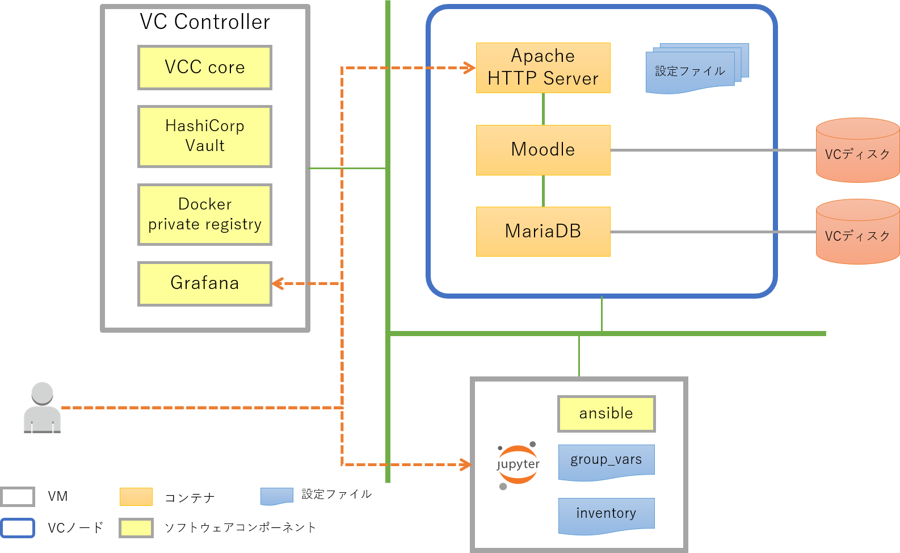
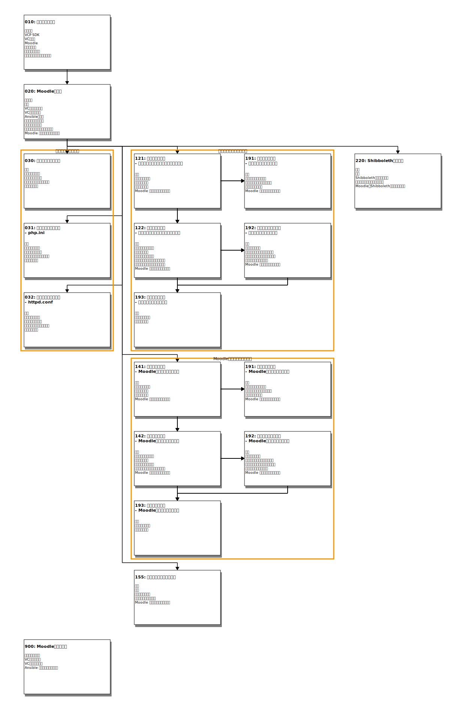

# README

---

VCP SDKを用いてクラウド上にMoodle環境を構築します。

## 構成について

このアプリケーションテンプレートではDockerコンテナを用いて[Moodle](https://moodle.org/)環境の構築を行います。
構築する環境は次の３つのコンテナで構成されます。

* Moodle
  - MoodleのPHPスクリプトを実行するコンテナ
* [MariaDB](https://hub.docker.com/_/mariadb/)
  - Moodleの設定を保存するデータベース
* [Apache HTTP Server](https://hub.docker.com/_/httpd/)
  - Moodleサーバに対するリバースプロキシ

ここでは小規模構成を想定して３つのコンテナを１つのVCノードに配置する構成とします。
またMoodleとMariaDBコンテナに対しては、データを保存するためのVCディスクをそれぞれのコンテナに割り当てます。

## 事前の準備

このアプリケーションテンプレートを実行する前に、以下のものを準備しておいてください。

* Moodle環境を公開するときのURL
* URLに対応するサーバ証明書とその秘密鍵
* Moodleを構築する仮想マシンにSSHでログインする際に用いるSSHの公開鍵の秘密鍵

サーバ証明書、SSHの公開鍵などは事前にこのNotebook環境にアップロードしておいてください。

## Notebookの一覧

お手本Notebookの一覧を示します。

**注意**:

この節ではお手本Notebookへのリンクを示す箇所がありますが、リンク先のNotebookは参照用となっていて**そのままでは実行できません**。

> Notebook自体は実行できてしまいますが、パスなどが想定しているものと異なるため正しく処理できずエラーとなります。

次のどちらかの手順で作業用Notebookを作成する必要があります。

1. [000-README.ipynb#作業用Notebookの作成](000-README.ipynb#作業用Notebookの作成)で作業用のNotebookを作成する。
1. お手本Notebookを配置してある `notebooks/` から、`README.md`と同じディレクトリにNotebookをコピーする。

### 各Notebookの関連について

各お手本Notebookの関係を示す図を以下に示します。図に表示される１つのブロックが１つのNotebookに対応しています。

### Notebookの目次

各お手本Notebookの目次を示します。リンクが表示されている項目が一つのNotebookに対応しています。

* [010:  パラメータ設定](notebooks/010-パラメータ設定.ipynb)
    1. 全体構成
        - VCP SDKを用いてクラウド上に仮想マシンを作成し、そこにMoodle環境を構築します
    1. VCP SDK
        - VCP SDKを利用する際に必要となるパラメータを設定します
    1. VCノード
        - Moodle環境を構築するVCノード（仮想マシン）に関するパラメータを指定します
    1. Moodle
        - Moodleのバージョン等の、直接Moodleに関わるパラメータを指定します
    1. データベース
        - Moodleの設定値などを保存するデータベースに関するパラメータを指定します
    1. リバースプロキシ
        - Moodleコンテナの前でリクエストを受け付けるリバースプロキシに関するパラメータを指定します
    1. チェックとデフォルト値の保存
        - 全てのパラメータが設定されたことをチェックします
* [020:  Moodleの起動](notebooks/020-Moodleの起動.ipynb)
    1. 全体構成

    1. 準備
        - 「010-パラメータの設定.ipynb」で指定したパラメータを引き継ぐための準備を行います
    1. VCディスクの作成
        - Moodleとデータベース用にそれぞれ専用の仮想ディスクを用意します
    1. VCノードの起動
        - VCP SDK を利用してVCノードを起動します
    1. Ansibleの設定
        - VCノードをAnsibleで操作するための設定を行います
    1. データ格納領域の準備
        - Moodle用, データベース用のディスクをデータを格納する領域として利用できるように準備します
    1. 設定ファイルの配置
        - アプリケーションコンテナを実行するのに必要となる設定ファイルを実行環境(VCノード)に配置します
    1. アプリケーションコンテナの起動
        - Moodleコンテナ、データベースコンテナ、リバースプロキシコンテナを起動して、Moodle環境を起動します
    1. Moodle を利用できることを確認
        - 構築したMoodle環境にアクセスし、Moodle が利用できることを確認します
* [030:  設定ファイルの変更](notebooks/030-設定ファイルの変更.ipynb)
    1. 概要
        - 構築したMoodle環境では利用者が変更する可能性のある `php.ini` などの設定ファイルをコンテナではなくVCノードに配置しています
    1. パラメータの設定

    1. 設定ファイルの編集
        - Moodleコンテナの設定ファイルをローカル環境に取得して、Jupyter Notebookの編集機能を用いて設定ファイルを編集します
    1. 編集した設定ファイルの反映
        - 編集したファイルをVCノードに配置して、設定ファイルの変更内容をコンテナに反映させます
    1. 変更を取り消す
        - 編集前の設定ファイルの状態に戻します
* [031:  設定ファイルの変更--php.ini](notebooks/031-設定ファイルの変更.ipynb)
    1. 概要
        - 設定ファイルを変更する例としてMoodleコンテナの `php.ini` に設定されている `upload_max_filesize`, `post_max_size` の値を変更してみます
    1. パラメータの設定
        - 変更対象のコンテナ名、設定ファイル名などを指定します
    1. 設定ファイルの編集
        - Moodleコンテナの設定ファイル`php.ini`をローカル環境に取得しJupyter Notebookの編集機能を用いて編集します
    1. 編集した設定ファイルの反映
        - 編集したファイルをVCノードに配置して、設定ファイルの変更内容をコンテナに反映させます
    1. 変更を取り消す
        - 編集前の設定ファイルの状態に戻します
* [032:  設定ファイルの変更--httpd.conf](notebooks/032-設定ファイルの変更.ipynb)
    1. 概要
        - 設定ファイルを変更する例としてリバースプロキシコンテナの`httpd.conf`を編集して、起動時のサーバプロセス数を変更してみます
    1. パラメータの設定
        - 変更対象のコンテナ名、設定ファイル名などを指定します
    1. 設定ファイルの編集
        - リバースプロキシコンテナの設定ファイル`httpd.conf`をローカル環境に取得しJupyter Notebookの編集機能を用いて設定ファイルを編集します
    1. 編集した設定ファイルの反映
        - 編集したファイルをVCノードに配置して、設定ファイルの変更内容をコンテナに反映させます
    1. 変更を取り消す
        - 編集前の設定ファイルの状態に戻します
* [121:  検証環境の構築--コンテナのセキュリティアップデート](notebooks/121-検証環境の構築--コンテナのセキュリティアップデート.ipynb)
    1. 概要
        - Moodleコンテナのパッケージをアップデートする場合の検証環境を構築します
    1. パラメータの設定
        - 対象となるコンテナ名や、検証環境にアクセスできる条件などを設定します
    1. 検証環境の作成
        - 現在運用中の環境を複製して、検証環境を作成します
    1. 検証環境の起動
        - 検証環境のコンテナを起動します
    1. Moodle を利用できることを確認
        - 検証用のMoodle環境にアクセスして正しく動作していることを確認します
* [122:  運用環境の移行--コンテナのパッケージアップデート](notebooks/122-運用環境の移行--コンテナのセキュリティアップデート.ipynb)
    1. 概要
        - 検証した設定を用いて新しい運用環境を構築し、運用環境の切り替えを行います
    1. 新しい運用環境の作成
        - 検証環境を元にした新しい運用環境を作成します
    1. 検証環境の削除
        - 新しい運用環境が作成され、不要となった検証環境を削除します
    1. 新しい運用環境の起動
        - 新しい運用環境のコンテナを起動します
    1. パッケージが更新されたことの確認
        - 古い運用環境と新しい運用環境のパッケージの一覧を比較することで、更新されたパッケージを確認します
    1. 古い運用環境のコンテナを停止する
        - 古い運用環境のコンテナを停止します
    1. Moodle を利用できることを確認
        - 新しい運用環境のMoodle環境にアクセスして正しく動作していることを確認します
* [141:  検証環境の構築--Moodleのバージョンアップ](notebooks/141-検証環境の構築--Moodleのバージョンアップ.ipynb)
    1. 概要
        - Moodleのバージョンアップを行う場合の検証環境を構築します
    1. パラメータの設定
        - Moodleのバージョンや、検証環境にアクセスできる条件などを設定します
    1. 検証環境の作成
        - 現在運用中の環境を複製して、検証環境を作成します
    1. 検証環境の起動
        - 検証環境のコンテナを起動します
    1. Moodle を利用できることを確認
        - 検証用のMoodle環境にアクセスし、指定したバージョンのMoodleが利用できることを確認します
* [142:  運用環境の移行--Moodleのバージョンアップ](notebooks/142-運用環境の移行--Moodleのバージョンアップ.ipynb)
    1. 概要
        - 検証した設定を用いて新しい運用環境を構築し、運用環境の切り替えを行います
    1. 新しい運用環境の作成
        - 検証環境を元にした新しい運用環境を作成します
    1. 検証環境の削除
        - 新しい運用環境が作成され、不要となった検証環境を削除します
    1. 新しい運用環境の起動
        - 新しい運用環境のコンテナを起動します
    1. 古い運用環境のコンテナを停止する
        - 古い運用環境のコンテナを停止します
    1. Moodle を利用できることを確認
        - 新しい運用環境のMoodle環境にアクセスして正しく動作していることを確認します
* [155:  コンテナイメージの更新](notebooks/155-コンテナイメージの更新.ipynb)
    1. 概要
        - リバースプロキシコンテナのコンテナイメージを更新します
    1. 準備
        - 「010-パラメータの設定.ipynb」などで既に設定したパラメータを引き継ぐための準備を行います
    1. パラメータの設定
        - 新しいコンテナイメージ名を指定します
    1. アップデート環境の起動
        - リバースプロキシコンテナを新しいコンテナイメージで起動し直します
    1. Moodle を利用できることを確認
        - Moodle環境にアクセスして正しく動作していることを確認します
* [191:  検証環境の削除](notebooks/191-検証環境の削除.ipynb)
    1. 概要
        - 検証環境を削除します
    1. リバースプロキシの設定
        - 検証用のアドレスからのアクセスも元の運用環境にアクセスできるようにリバースプロキシの設定を変更します
    1. 検証環境のコンテナを停止する

    1. 検証環境を削除する

    1. Moodle を利用できることを確認
        - Moodle環境にアクセスして正しく動作していることを確認します
* [192:  元の運用環境に戻す](notebooks/192-元の運用環境に戻す.ipynb)
    1. 概要
        - 運用環境を移行前の環境に戻します
    1. パラメータの設定
        - 元に戻す対象となる運用環境のタグの値を指定します
    1. メンテナンスモードへの切り替え
        - 運用環境の切り替えを行う間に新たなデータが書き込まれないようにするために、メンテナンスモードに切り替えます
    1. 元の運用環境のコンテナを起動する

    1. 元の運用環境に切り替える
        - リバースプロキシの設定を変更して、運用環境を切り替えます
    1. Moodle を利用できることを確認
        - 新しい運用環境のMoodle環境にアクセスして正しく動作していることを確認します
* [193:  古い環境の削除](notebooks/193-古い環境の削除.ipynb)
    1. 概要
        - 古い運用環境のリソース（論理ボリューム、設定ファイル、コンテナイメージ）を削除します
    1. パラメータの設定
        - 削除候補となる運用環境のタグの一覧を表示します
    1. 古い環境の削除

* [220:  Shibboleth認証設定](notebooks/220-Shibboleth認証設定.ipynb)
    1. 概要
        - 構築済のMoodle環境にShibbolethコンテナを追加し、MoodleのShibboleth認証の機能を有効にします
    1. 準備

    1. Shibbolethコンテナの追加
        - 現在のMoodle環境に Shibboleth コンテナを追加します
    1. 設定ファイルの編集と反映を行う
        - Shibbolethに関する設定ファイルの編集とその反映をおこないます
    1. MoodleのShibbolethプラグインの設定

* [900:  Moodle環境の削除](notebooks/900-Moodle環境の削除.ipynb)
    1. パラメータの設定
        - 構築環境を削除するのに必要となるパラメータを設定します
    1. VCノードの削除
        - Moodle環境のVCノードを削除します
    1. VCディスクの削除
        - Moodle環境で利用していたVCディスクを削除します
    1. Ansible 設定ファイルの後始末
        - Ansibleに関する設定ファイルの後始末を行います
