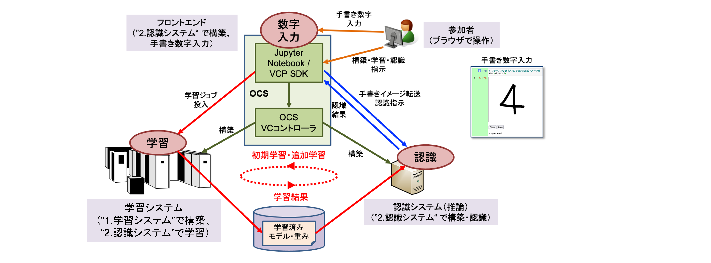

# OpenHPC v2 テンプレートを利用した手書き数字認識システムの構築

[OpenHPC-v2](https://github.com/nii-gakunin-cloud/ocs-templates/tree/master/OpenHPC-v2) テンプレートを使うと、クラウド上に GPU ノードクラスタを構築することができます。機械学習フレームワークである TensorFlow と Pytorch もサポートしています。

機械学習を使ったアプリケーション環境では、アプリケーションの実行環境では推論のみ行い、学習は別のシステムで行う構成を取ることがよくあります。これは、必要な計算能力やメモリ容量が「学習 >> 推論」であることや、秘密情報を含む学習データをユーザーがアクセスできる環境に置きたくないなどの理由によるものです。

そこで、本テンプレートでは以下を体験していただくことができます。

* 学習システムの構築：[OpenHPC-v2](https://github.com/nii-gakunin-cloud/ocs-templates/tree/master/OpenHPC-v2) テンプレートをカスタマイズしたNotebookにより GPU ノードベースの学習システム（機械学習フレームワーク：Tensorflow）を構築する
* 認識システムの構築：本テンプレート独自のNotebookにより CPU ベースの認識システムを構築する
* 手書き数字入力環境（フロントエンド）の構築と認識：本来は認識システムと同じシステムに構築されることが多いと思うが、今回はJupyterNotebook上に構築し手書き数字認識を行う

## 実行の流れ
### 「[1.学習システム](1.learning_system)」による GPU ベースの学習システム（Tensorflow ベース）の構築
1. [OpenHPC-v2](https://github.com/nii-gakunin-cloud/ocs-templates/tree/master/OpenHPC-v2) テンプレートを利用して学習システムを構築します。[OpenHPC-v2](https://github.com/nii-gakunin-cloud/ocs-templates/tree/master/OpenHPC-v2) テンプレートは作業別に複数のNotebookに分割されており、組み合わせることにより目的に沿った環境を構築できます。本テンプレートでは、学習システムとして Docker, GPU, TensorFlow を利用した OpenHPC 環境を構築します。なお、本テンプレートで使用するNotebookは、あらかじめユーザーが定義すべき値を設定し、誤操作しそうな一部動作を変更しています。追加・変更したセルには"★★★"マークのついたコメントを記入してあります。また、構築に必要な作業を一つのNotebookにまとめています(`1010-機械学習システム.GPU.ipynb`)。
 
### 「[2.認識システム](2.recognition_system)」によるCPU ベースの認識システム、MNISTデータの学習、手書き数字入力システムの構築、認識実験
1. 認識システムを構築します。構成は CPU のみのVCノード１台で、学習/認識フレームワークは TensorFlow とします（`2001.認識システムの構築.ipynb`）。
1. 学習システムで、手書き数字学習データ（MNIST）の学習し、学習結果の転送を行います（`2002.学習システムを使った学習.ipynb`）。
1. JupyterNotebook上にフリーハンド入力環境を構築し、入力したイメージを認識システムに転送し認識させます。学習モデルを変更したり、イメージの前処理を追加することで認識結果が変化する実験も行います（`2003.手書き数字入力環境の構築と認識実験.ipynb`）。

### 環境の削除
1. 学習システムは「[1.学習システム](1.learning_system)」の`1920-OpenHPC環境の削除.ipynb`で、認識システムは「[2.認識システム](2.recognition_system)」の`2004.認識システムの削除.ipynb`で削除します。

