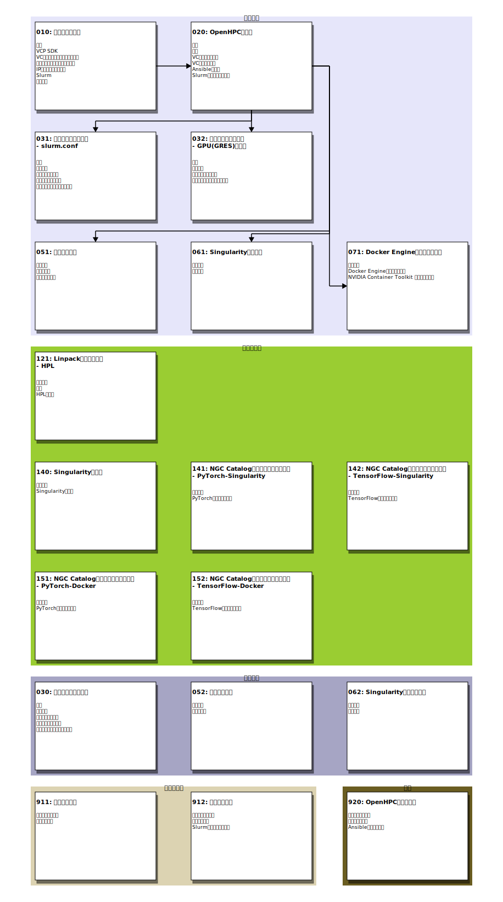
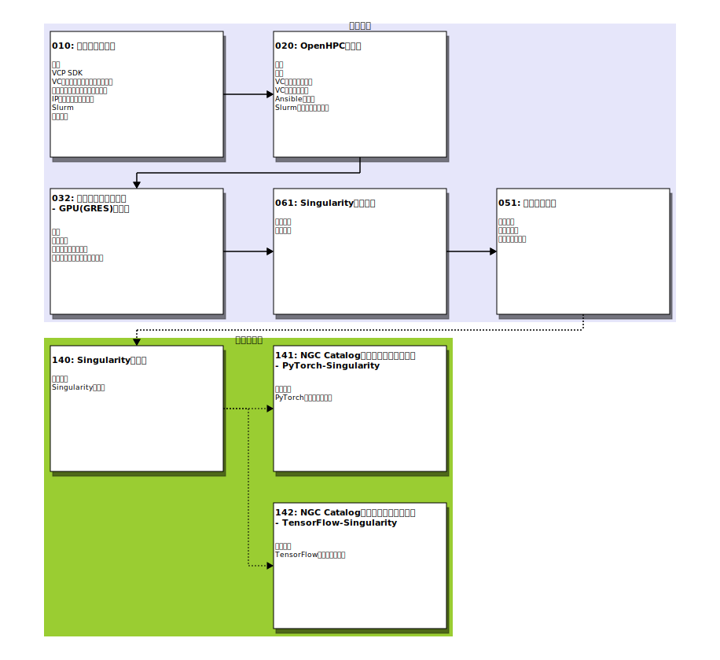
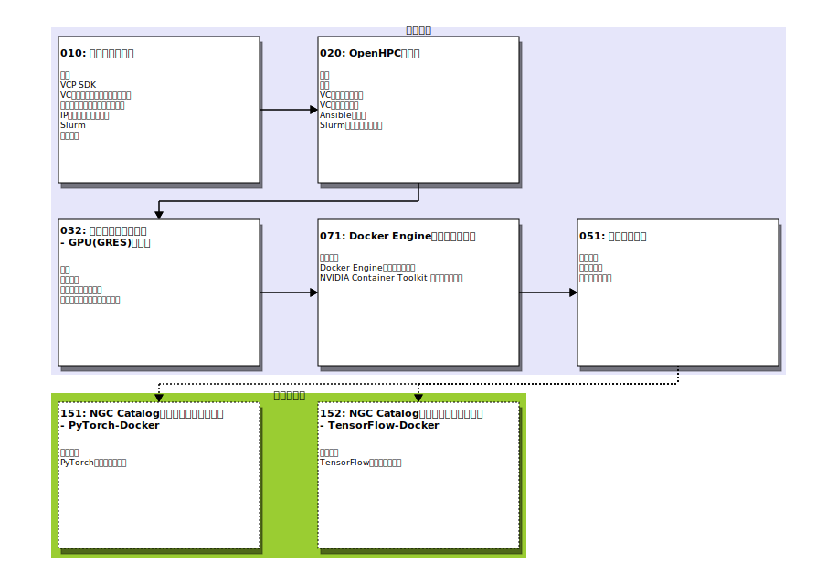

# README

---

VCP SDKを用いてクラウド上にOpenHPC環境を構築します。

## 概要

[OpenHPC](https://openhpc.community/)で配布しているパッケージを利用してクラウド上にHPC環境を構築します。

### 構成について

構築するOpenHPC環境は１つのマスターノード（ヘッドノード）と複数の計算ノードによって構成されます。
マスターノードはNFSサーバとしての役割も担います。NFSによってホームディレクトリやライブラリなどのファイルを計算ノードとの間で共有します。

OpenHPCではジョブスケジューラとして[Slurm](https://www.schedmd.com/)と[OpenPBS](https://www.openpbs.org/)が選択できますが、このテンプレートではSlurmを使用します。

### 構築方法について

OpenHPCのInstall guideでは[Warewulf](http://warewulf.lbl.gov/)などを用いて計算ノードのプロビジョニングを行っています。このテンプレートでは Warewulf などを利用せずに、VCP SDKを用いてマスターノードと計算ノードのプロビジョニングを行います。VCP SDKを用いることでクラウド上に仮想サーバを作成することができます。またNFS用の仮想ディスクもVCP SDKによって作成します。VCP SDKが作成する仮想サーバ、仮想ディスクのことを VCノード、VCディスクと呼びます。

#### VCノードの作成

VCノード（クラウド上の仮想サーバ）を作成するには、このNotebook環境に用意されているVCP SDKを利用します。VCP SDKはNotebook環境から利用できるPython3のライブラリで、パブリッククラウド上(AWS, Azure, ...)に仮想サーバや仮想ディスクを作成する操作を簡単に行うことができます。

実際のクラウドに対する操作はVCP SDKが直接行うのではなくVC Controllerと呼ばれるVCPのサーバによって実行されます。VC ControllerのAPIをNotebook環境から直接利用することも可能ですが、利用しやすいようにライブラリとしてまとめたものが VCP SDKになります。VC Contorollerを利用するには、アクセストークンが必要となります。VCP SDKを利用する場合も同様にVC Controllerのアクセストークンが必要となりますので、事前にVC管理者に対してアクセストークンの発行を依頼しておいてください。

#### VCノードのイメージ選択

VCPでは利用者に対して、異なるクラウド(AWS, Azure, ...)の仮想サーバを同一の環境として提供するために[Docker コンテナ](https://www.docker.com/)を利用しています。クラウドのVM/BMをVCノードとして組み入れる際にVCPが各VM/BMの上で共通環境となるコンテナを起動します。VCPではこのコンテナのことをBaseコンテナと呼びます。Baseコンテナは仮想サーバのモニタリングなどのVCノードに共通する機能を提供する役割も担っています。

標準のBaseコンテナは共通環境を提供することを目的としていますが、それとは別に特定の利用目的を持ったBaseコンテナを
アプリケーションテンプレートでは提供しています。OpenHPC向けには、マスターノード用Baseコンテナイメージと計算ノード用Baseコンテナイメージを用意しています。

#### VCディスクの作成

VCディスク（クラウド上の仮想ディスク）もVCノードと同様にVCP SDKを利用することで作成できます。

現在VCディスクを作成できるプロバイダは `AWS` ,`Azure` , `Oracle Cloud` に限定されています。その他のプロバイダでOpenHPC環境を構築することを考慮して、このアプリケーションテンプレートではマスターノードにNFS用ディスクを作成しない構成にも対応しています。NFS用ディスクを作成しない場合は仮想ノードのルートボリュームを直接利用するので、ルートボリュームサイズに大きめの値を指定してください。

### バージョン

このテンプレートで構築するミドルウェア、OSのバージョンを示します。

* [OpenHPC 2.7](https://github.com/openhpc/ohpc/releases/tag/v2.7.GA)
* Rocky Linux 8.8

### 前提条件

#### 時刻同期

OpenHPCでは各ノードの時刻が正しく設定されている必要があります。

VCPで時刻同期を行うには、リリースノート「[Release/20.10.0 -- 2.機能追加](https://meatwiki.nii.ac.jp/confluence/pages/viewpage.action?pageId=32677360#id-%E3%83%AA%E3%83%AA%E3%83%BC%E3%82%B9%E3%83%8E%E3%83%BC%E3%83%88-Release/20.10.0(2020/10/30))」に記されているようにVCコントローラへの設定が必要となります。
OpenHPCの構築を行う前にOCS運用担当者にVCコントローラへの設定を依頼してください。

## Notebookについて

OpenHPCテンプレートのNotebookについて記します。

### 実行方法

テンプレートのNotebookを実行するには、下記に示すいずれかの手順で作業用Notebookを作成する必要があります。

* [000-README.ipynb#作業用notebookの作成](000-README.ipynb#作業用Notebookの作成)で作業用のNotebookを作成する
* テンプレートのNotebookを配置してあるディレクトリ [`notebooks/`](./notebooks/) から、`README.md`(このファイル)と同じディレクトリに手作業でコピーする

#### 注意

 [`notebooks/`](./notebooks/)に配置してあるNotebokをそのまま実行すると、他のファイルのパスなどが想定しているものと異なるため、
***正しく処理できずエラーとなります***。

### 実行順序

テンプレートのNotebookを実行する順序について記します。
はじめに全てのNotebookの関係について示し、その後に具体的な目的に応じた実行手順を例示します。
具体例としては以下のものを示します。

* LINPACKを実行する
* NGC(NVIDIA GPU CLOUD)カタログのコンテナを実行する

#### Notebook間の関係について

テンプレートの全Notebook間の関係を示す図を表示します。ひとつの長方形の枠がテンプレートのNotebookに対応しています。

#### LINPACKを実行する

OpenHPC環境で[HPL(High-Performance Linpack Benchmark)](http://www.netlib.org/benchmark/hpl/)を実行する手順の例を図に示します。

まずは「環境構築」に表示されている、以下の４つのNotebookでOpenHPC環境の構築を行います。

* 010: パラメータ設定
* 020: OpenHPCの起動
* 031: 設定ファイルの編集 - slurm.conf
* 051: ユーザの追加

その後、構築したOpenHPC環境でHPLをジョブとして実行します。ジョブの実行は構築の際に利用した管理権限のあるユーザではなく「051:ユーザの追加」で作成した一般ユーザによって行うことを想定しています。

* 121: Linpackベンチマーク - HPL

#### NGC(NVIDIA GPU CLOUD)カタログのコンテナをSingularityで実行する

OpenHPC環境で[NGCカタログ](https://ngc.nvidia.com/)のコンテナをSingularityで実行する手順の例を図に示します。

まずは「環境構築」に表示されている、以下の５つのNotebookでOpenHPC環境の構築を行います。ここではGPUを利用したジョブを実行することを想定してます。そのため「032: 設定ファイルの編集 - GPU(GRES)の登録」により Slurm にGPUをリソース登録します。またコンテナを実行するために「061: Singularityのロード」を用いてSingularityのセットアップを行います。

* 010: パラメータ設定
* 020: OpenHPCの起動
* 032: 設定ファイルの編集 - GPU(GRES)の登録
* 061: Singularityのロード
* 051: ユーザの追加

その後、構築したOpenHPC環境でNGCカタログのコンテナを利用したジョブを実行します。ジョブの実行は構築の際に利用した管理権限のあるユーザではなく「051:ユーザの追加」で作成した一般ユーザによって行うことを想定しています。この実行例ではNGCカタログのコンテナを実行する前に「140: Singularityの利用」によってSingularityを用いたコンテナ実行の手順を確認しています。

* 140: Singularityの利用
* 141: NGC Catalogのコンテナを実行する - PyTorch-Singularity
* 142: NGC Catalogのコンテナを実行する - TensorFlow-Singularity

##### 注意

NGCカタログのコンテナを実行する場合は、環境構築で実行する「010: パラメータ設定」のNotebookで以下のような設定が必要となります。

* 4.1.3 計算ノードのインスタンスタイプ
    - `compute_instance_type`にNVIDIAのGPUを利用できるインスタンスタイプ、VMサイズを指定してください
    - 動作確認済のインスタンスタイプ・VMサイズを以下に示します
        + AWS
            - [G4(NVIDIA T4)](https://aws.amazon.com/jp/ec2/instance-types/g4/)
            - [G3(NVIDIA M60)](https://aws.amazon.com/jp/ec2/instance-types/g3/)
            - [P3(NVIDIA V100)](https://aws.amazon.com/jp/ec2/instance-types/p3/)
        + Azure
            - [NC T4_v3(NVIDIA T4)](https://docs.microsoft.com/ja-jp/azure/virtual-machines/nct4-v3-series)
            - [NCv3(NVIDIA V100)](https://docs.microsoft.com/ja-jp/azure/virtual-machines/ncv3-series)
            - [NV(NVIDIA M60)](https://docs.microsoft.com/ja-jp/azure/virtual-machines/nv-series)
            - [NVv3(NVIDIA M60)](https://docs.microsoft.com/ja-jp/azure/virtual-machines/nvv3-series)
        + Oracle Cloud
            - [VM.GPU2(NVIDIA P100)](https://www.oracle.com/jp/cloud/compute/gpu.html)
    - AWS P2などのNVIDIA K80ではCUDA Compute Capabilityが3.7なのでNGCカタログのコンテナが実行できません

* 4.1.5 計算ノードにおけるGPUの利用
    - `compute_use_gpu`の値に`True` を指定してください
* 4.2.3 マスターノードのルートボリュームサイズ
    - コンテナイメージをSingularityで利用できるように処理するための作業領域としてある程度以上のサイズが必要となります
    - NGCカタログのPyTorchまたはTensorFlowのコンテナイメージを利用するには、`master_root_size`に少なくとも 60GB 以上の値を指定してください

> 上に示した「4.1.3」などの表記は Notebook「010: パラメータ設定」における章番号になります。

#### NGC(NVIDIA GPU CLOUD)カタログのコンテナをDockerで実行する

[NGCカタログ](https://ngc.nvidia.com/)のコンテナをDockerで実行する手順の例を図に示します。前節との違いはコンテナの実行に SingularityではなくDockerを利用することになります。

まずは「環境構築」に表示されている５つのNotebookでOpenHPC環境の構築を行います。ここではGPUを利用したジョブを実行することを想定してます。そのため「032: 設定ファイルの編集 - GPU(GRES)の登録」により Slurm にGPUをリソース登録します。またユーザにdockerコマンドの実行を許可するために「051: ユーザの追加」で追加するユーザに `docker` グループへの追加が必要となります。

* 010: パラメータ設定
* 020: OpenHPCの起動
* 032: 設定ファイルの編集 - GPU(GRES)の登録
* 071: Docker Engineのインストール
* 051: ユーザの追加

その後、構築したOpenHPC環境でNGCカタログのコンテナを利用したジョブを実行します。

* 151: NGC Catalogのコンテナを実行する - PyTorch-Docker
* 152: NGC Catalogのコンテナを実行する - TensorFlow-Docker

### Notebookの目次

テンプレートの各Notebookの目次を示します。リンクが表示されている項目が一つのNotebookに対応しています。

* [010: パラメータ設定](notebooks/010-パラメータ設定.ipynb)
    1. 概要
        - VCP SDKを用いてクラウド上に仮想サーバを作成し、OpenHPC環境の構築を行います
    1. VCP SDK
        - VCP SDKを利用する際に必要となるパラメータを設定します
    1. VCノードに共通するパラメータ
        - マスターノード、計算ノードに共通するパラメータを指定します
    1. 構築環境に割り当てるリソース
        - 各VCノード、VCディスクに割り当てるリソースを指定します
    1. IPアドレスとホスト名
        - 各ノードに設定するIPアドレスとホスト名を指定します
    1. Slurm
        - Slurmに関連するパラメータを指定します
    1. チェック
        - 設定項目漏れがないことを確認します
* [020: OpenHPCの起動](notebooks/020-OpenHPCの起動.ipynb)
    1. 構成
        - このNotebookが構築する環境の構成を図に示します
    1. 準備
        - このNotebookを実行するための準備作業を行います
    1. VCディスクの作成
        - マスターノードのNFSサーバが公開するファイルを配置するためのディスクを作成します
    1. VCノードの起動
        - マスターノード、計算ノードとして利用するVCノードを起動します
    1. Ansibleの設定
        - VCノードをAnsibleで操作するための設定を行います
    1. Slurmの状態を確認する
        - 起動したVCノードで実行されているSlurmの状態を確認します
* [030: 設定ファイルの編集](notebooks/030-設定ファイルの編集.ipynb)
    1. 概要
        - このNotebookではVCノードの設定ファイルを編集し、その結果を各VCノード配布する手順を示します
    1. 前提条件
        - このNotebookを実行するための前提条件を満たしていることを確認します
    1. パラメータの設定

    1. 設定ファイルの編集
        - OpenHPC環境の設定ファイルを取得して、Jupyter Notebookの編集機能を用いて設定ファイルを編集します
    1. 編集した設定ファイルの反映
        - 編集したファイルをVCノードに配置して、設定ファイルの変更内容をコンテナに反映させます
* [031: 設定ファイルの編集 -- slurm.conf](notebooks/031-設定ファイルの編集-slurm_conf.ipynb)
    1. 概要
        - このNotebookでは、VCノードの`slurm.conf`の内容を変更し、その変更を反映する手順を示します
    1. 前提条件
        - このNotebookを実行するための前提条件を満たしていることを確認します
    1. パラメータの設定

    1. 設定ファイルの編集
        - OpenHPC環境の設定ファイルを取得して、Jupyter Notebookの編集機能を用いて設定ファイルを編集します
    1. 編集した設定ファイルの反映
        - 編集したファイルをVCノードに配置して、設定ファイルの変更内容をコンテナに反映させます
* [032: 設定ファイルの編集--GPU(GRES)の登録](notebooks/032-設定ファイルの編集-GRESの登録.ipynb)
    1. 概要
        - このNotebookでは、GPUなどをSlurmの[Generic Resource(GRES)](https://slurm.schedmd.com/gres.html)として追加する手順を示します
    1. 前提条件
        - このNotebookを実行するための前提条件を満たしていることを確認します
    1. 設定ファイルの編集
        - OpenHPC環境の設定ファイルを取得して、Jupyter Notebookの編集機能を用いて設定ファイルを編集します
    1. 編集した設定ファイルの反映
        - 編集したファイルをVCノードに配置して、設定ファイルの変更内容をコンテナに反映させます
* [051: ユーザの追加](notebooks/051-ユーザの追加.ipynb)
    1. 前提条件
        - このNotebookを実行するための前提条件を満たしていることを確認します
    1. ユーザ登録
        - OpenHPC環境にユーザを登録します
    1. グループの追加
        - ユーザをプライマリグループ(メイングループ)以外のグループに登録する場合はこの節を実行してください
* [052: ユーザの削除](notebooks/052-ユーザの削除.ipynb)
    1. 前提条件
        - このNotebookを実行するための前提条件を満たしていることを確認します
    1. ユーザ削除
        - OpenHPC環境のユーザを削除します
* [061: Singularityのロード](notebooks/061-Singularityのロード.ipynb)
    1. 前提条件
        - このNotebookを実行するための前提条件を満たしていることを確認します
    1. 設定変更
        - Singularity(version:3.7.1)をデフォルトで利用できるようにするために `/etc/profile.d/` の設定ファイルを変更します
* [062: Singularityのアンロード](notebooks/062-Singularityのアンロード.ipynb)
    1. 前提条件
        - このNotebookを実行するための前提条件を満たしていることを確認します
    1. 設定変更
        - Singularityをデフォルトではロードされないようにするために `/etc/profile.d/` の設定ファイルを変更します
* [071: Docker Engineのインストール](notebooks/071-DockerEngineのインストール.ipynb)
    1. 前提条件
        - このNotebookを実行するための前提条件を満たしていることを確認します
    1. Docker Engineのインストール
        - [Install Docker Engine on CentOS](https://docs.docker.com/engine/install/centos/)の手順に従い Docekr Engineを計算ノードにインストールします
* [121: Linpackベンチマーク -- HPL](notebooks/121-Linpackベンチマーク-HPL.ipynb)
    1. 前提条件
        - このNotebookを実行するための前提条件を満たしていることを確認します
    1. 準備
        - HPLを実行するための準備作業を行います
    1. HPLの実行
        - HPLを実行します
* [140: Singularityの利用](notebooks/140-Singularityの利用.ipynb)
    1. 前提条件
        - このNotebookを実行するための前提条件を満たしていることを確認します
    1. Singularityの実行
        - singularityで docker コンテナイメージを実行してみます
* [141: NGC Catalogのコンテナを実行する--PyTorch-Singularity](notebooks/141-NGCのコンテナ実行-PyTorch.ipynb)
    1. 前提条件
        - このNotebookを実行するための前提条件を満たしていることを確認します
    1. PyTorchコンテナの実行
        - PyTorchコンテナでMNISTを実行してみます
* [142: NGC Catalogのコンテナを実行する--TensorFlow-Singularity](notebooks/142-NGCのコンテナ実行-TensorFlow.ipynb)
    1. 前提条件
        - このNotebookを実行するための前提条件を満たしていることを確認します
    1. TensorFlowコンテナの実行
        - TensorFlowコンテナでMNISTを実行してみます
* [151: NGC Catalogのコンテナを実行する--PyTorch-Docker](notebooks/151-NGCのコンテナ実行-PyTorch.ipynb)
    1. 前提条件
        - このNotebookを実行するための前提条件を満たしていることを確認します
    1. PyTorchコンテナの実行
        - PyTorchコンテナでMNISTを実行してみます
* [152: NGC Catalogのコンテナを実行する--TensorFlow-Docker](notebooks/152-NGCのコンテナ実行-TensorFlow.ipynb)
    1. 前提条件
        - このNotebookを実行するための前提条件を満たしていることを確認します
    1. TensorFlowコンテナの実行
        - TensorFlowコンテナでMNISTを実行してみます
* [911: ノードの停止](notebooks/911-ノードの停止.ipynb)
    1. パラメータの指定
        - ノードの停止を行うのに必要となるパラメータを入力します
    1. ノードの停止
        - 現在のノードの状態を確認します
* [912: ノードの再開](notebooks/912-ノードの再開.ipynb)
    1. パラメータの指定
        - ノードを再開するのに必要となるパラメータを入力します
    1. ノードの再開
        - 現在のノードの状態を確認します
    1. Slurmの状態を確認する
        - Slurmクラスタのノードの状態を確認します
* [920: OpenHPC環境の削除](notebooks/920-OpenHPC環境の削除.ipynb)
    1. パラメータの指定
        - 削除を行うのに必要となるパラメータを入力します
    1. 構築環境の削除
        - 構築したOpenHPC環境を削除します
    1. Ansible設定のクリア
        - 削除した環境に対応するAnsibleの設定をクリアします
