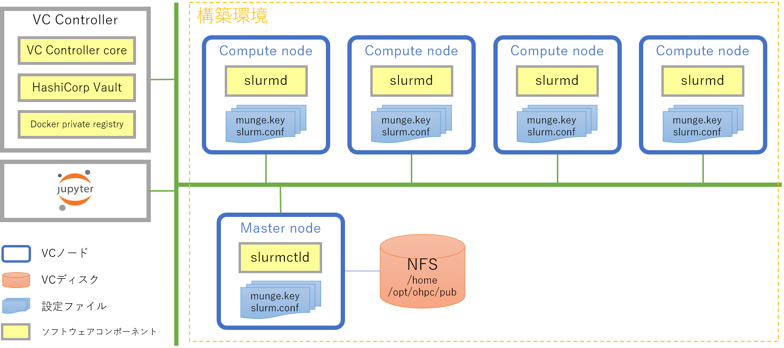
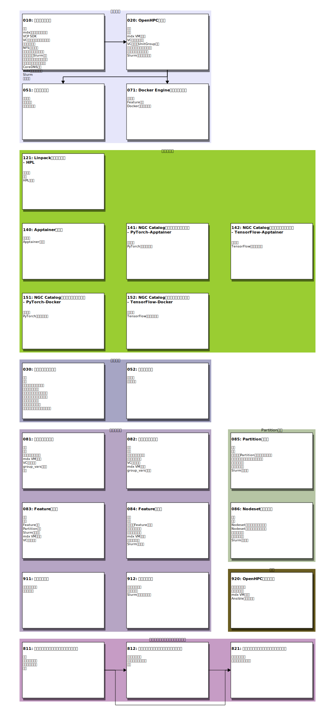
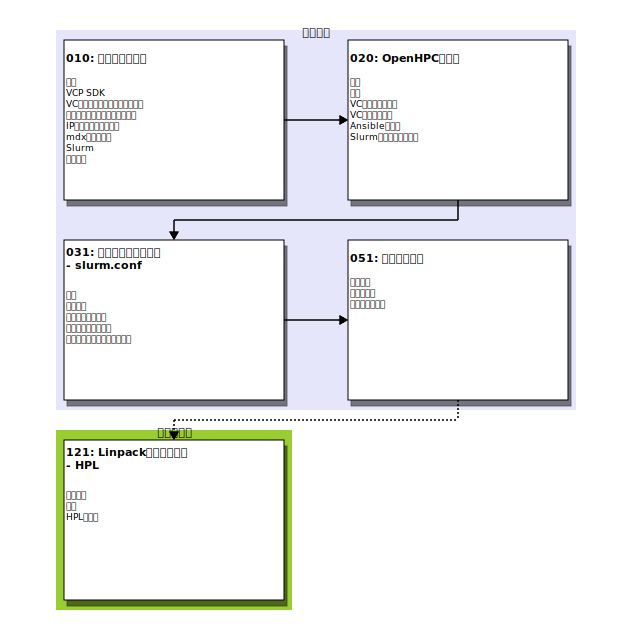
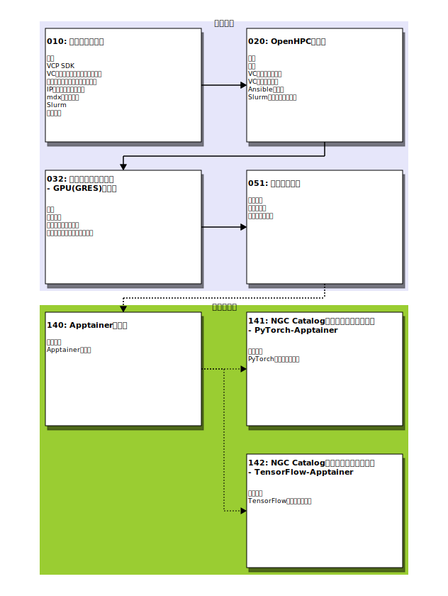
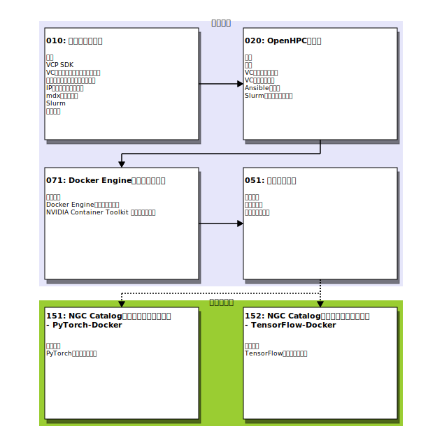

# README

---

VCP SDKを用いてクラウド上にOpenHPC環境を構築します。

## 概要

[OpenHPC](https://openhpc.community/)で配布しているパッケージを利用してクラウド上にHPC環境を構築します。

### 構成について

構築するOpenHPC環境は１つのマスターノード（ヘッドノード）と複数の計算ノードによって構成されます。
マスターノードはNFSサーバとしての役割も担います。NFSによってホームディレクトリやライブラリなどのファイルを計算ノードとの間で共有します。

OpenHPCではジョブスケジューラとして[Slurm](https://www.schedmd.com/)と[OpenPBS](https://www.openpbs.org/)が選択できますが、このテンプレートではSlurmを使用します。

### 構築方法について

OpenHPCのInstall guideでは[Warewulf](http://warewulf.lbl.gov/)などを用いて計算ノードのプロビジョニングを行っています。このテンプレートでは Warewulf などを利用せずに、VCP SDKを用いてマスターノードと計算ノードのプロビジョニングを行います。VCP SDKを用いることでクラウド上に仮想サーバを作成することができます。またNFS用の仮想ディスクもVCP SDKによって作成します。VCP SDKが作成する仮想サーバ、仮想ディスクのことを VCノード、VCディスクと呼びます。

#### VCノードの作成

VCノード（クラウド上の仮想サーバ）を作成するには、このNotebook環境に用意されているVCP SDKを利用します。VCP SDKはNotebook環境から利用できるPython3のライブラリで、パブリッククラウド上(AWS, Azure, ...)に仮想サーバや仮想ディスクを作成する操作を簡単に行うことができます。

実際のクラウドに対する操作はVCP SDKが直接行うのではなくVC Controllerと呼ばれるVCPのサーバによって実行されます。VC ControllerのAPIをNotebook環境から直接利用することも可能ですが、利用しやすいようにライブラリとしてまとめたものが VCP SDKになります。VC Contorollerを利用するには、アクセストークンが必要となります。VCP SDKを利用する場合も同様にVC Controllerのアクセストークンが必要となりますので、事前にVC管理者に対してアクセストークンの発行を依頼しておいてください。

#### VCノードのイメージ選択

VCPでは利用者に対して、異なるクラウド(AWS, Azure, ...)の仮想サーバを同一の環境として提供するために[Docker コンテナ](https://www.docker.com/)を利用しています。クラウドのVM/BMをVCノードとして組み入れる際にVCPが各VM/BMの上で共通環境となるコンテナを起動します。VCPではこのコンテナのことをBaseコンテナと呼びます。Baseコンテナは仮想サーバのモニタリングなどのVCノードに共通する機能を提供する役割も担っています。

標準のBaseコンテナは共通環境を提供することを目的としていますが、それとは別に特定の利用目的を持ったBaseコンテナを
アプリケーションテンプレートでは提供しています。OpenHPC向けには、マスターノード用Baseコンテナイメージと計算ノード用Baseコンテナイメージを用意しています。

#### VCディスクの作成

VCディスク（クラウド上の仮想ディスク）もVCノードと同様にVCP SDKを利用することで作成できます。

現在VCディスクを作成できるプロバイダは `AWS` ,`Azure` , `Oracle Cloud` に限定されています。その他のプロバイダでOpenHPC環境を構築することを考慮して、このアプリケーションテンプレートではマスターノードにNFS用ディスクを作成しない構成にも対応しています。NFS用ディスクを作成しない場合は仮想ノードのルートボリュームを直接利用するので、ルートボリュームサイズに大きめの値を指定してください。

### バージョン

このテンプレートで構築するミドルウェア、OSのバージョンを示します。

* [OpenHPC 3.4](https://github.com/openhpc/ohpc/releases/tag/v3.4.GA)
* Rocky Linux 9

### 非互換な変更について

> **注意:** このバージョンでは計算ノードの管理方法が大きく変更されており、25.04.0-20251223以前のテンプレートで構築した環境からのアップグレードはできません。
>
> 計算ノードの設定は `slurm_features` 辞書によるmulti-feature構成に変更されました。これにより、異なるインスタンスタイプやGPU有無などの構成を持つ計算ノード群をfeatureとして定義し、1つのクラスタ内で複数のfeatureを運用できます。この変更に伴い `group_vars` の構成が以前のバージョンと互換性がなくなっています。
>
> 以前のバージョンで構築した環境を利用されている場合は、旧環境を削除した上で新規に構築し直してください。旧環境のNFS上のユーザデータが必要な場合は、旧環境の削除前にバックアップを行ってください。

### 前提条件

#### 時刻同期

OpenHPCでは各ノードの時刻が正しく設定されている必要があります。

VCPで時刻同期を行うには、リリースノート「[Release/20.10.0 -- 2.機能追加](https://meatwiki.nii.ac.jp/confluence/pages/viewpage.action?pageId=32677360#id-%E3%83%AA%E3%83%AA%E3%83%BC%E3%82%B9%E3%83%8E%E3%83%BC%E3%83%88-Release/20.10.0(2020/10/30))」に記されているようにVCコントローラへの設定が必要となります。
OpenHPCの構築を行う前にOCS運用担当者にVCコントローラへの設定を依頼してください。

## Notebookについて

OpenHPCテンプレートのNotebookについて記します。

### 実行方法

テンプレートのNotebookを実行するには、下記に示すいずれかの手順で作業用Notebookを作成する必要があります。

* [000-README.ipynb#作業用notebookの作成](000-README.ipynb#作業用Notebookの作成)で作業用のNotebookを作成する
* テンプレートのNotebookを配置してあるディレクトリ [`notebooks/`](./notebooks/) から、`README.md`(このファイル)と同じディレクトリに手作業でコピーする

#### 注意

 [`notebooks/`](./notebooks/)に配置してあるNotebokをそのまま実行すると、他のファイルのパスなどが想定しているものと異なるため、
***正しく処理できずエラーとなります***。

### 実行順序

テンプレートのNotebookを実行する順序について記します。
はじめに全てのNotebookの関係について示し、その後に具体的な目的に応じた実行手順を例示します。
具体例としては以下のものを示します。

* LINPACKを実行する
* NGC(NVIDIA GPU CLOUD)カタログのコンテナを実行する

#### Notebook間の関係について

テンプレートの全Notebook間の関係を示す図を表示します。ひとつの長方形の枠がテンプレートのNotebookに対応しています。

#### LINPACKを実行する

OpenHPC環境で[HPL(High-Performance Linpack Benchmark)](http://www.netlib.org/benchmark/hpl/)を実行する手順の例を図に示します。

まずは「環境構築」に表示されている、以下の３つのNotebookでOpenHPC環境の構築を行います。

* 010: パラメータ設定
* 020: OpenHPCの起動
* 051: ユーザの追加

その後、構築したOpenHPC環境でHPLをジョブとして実行します。ジョブの実行は構築の際に利用した管理権限のあるユーザではなく「051:ユーザの追加」で作成した一般ユーザによって行うことを想定しています。

* 121: Linpackベンチマーク - HPL

#### NGC(NVIDIA GPU CLOUD)カタログのコンテナをApptainerで実行する

OpenHPC環境で[NGCカタログ](https://ngc.nvidia.com/)のコンテナをApptainerで実行する手順の例を図に示します。

まずは「環境構築」に表示されている、以下の３つのNotebookでOpenHPC環境の構築を行います。ここではGPUを利用したジョブを実行することを想定してます。

* 010: パラメータ設定
* 020: OpenHPCの起動
* 051: ユーザの追加

その後、構築したOpenHPC環境でNGCカタログのコンテナを利用したジョブを実行します。ジョブの実行は構築の際に利用した管理権限のあるユーザではなく「051:ユーザの追加」で作成した一般ユーザによって行うことを想定しています。この実行例ではNGCカタログのコンテナを実行する前に「140: Apptainerの利用」によってApptainerを用いたコンテナ実行の手順を確認しています。

* 140: Apptainerの利用
* 141: NGC Catalogのコンテナを実行する - PyTorch-Apptainer
* 142: NGC Catalogのコンテナを実行する - TensorFlow-Apptainer

##### 注意

NGCカタログのコンテナを実行する場合は、環境構築で実行する「010: パラメータ設定」のNotebookで以下のような設定が必要となります。

* 7.3 計算ノードのインスタンスタイプ
    - `compute_instance_type`にNVIDIAのGPUを利用できるインスタンスタイプ、VMサイズを指定してください
    - 動作確認済のインスタンスタイプ・VMサイズを以下に示します
        + AWS
            - [G5(NVIDIA A10G)](https://aws.amazon.com/jp/ec2/instance-types/g5/)
            - [G4(NVIDIA T4)](https://aws.amazon.com/jp/ec2/instance-types/g4/)
        + Azure
            - [NC T4_v3(NVIDIA T4)](https://docs.microsoft.com/ja-jp/azure/virtual-machines/nct4-v3-series)
            - [NCv3(NVIDIA V100)](https://docs.microsoft.com/ja-jp/azure/virtual-machines/ncv3-series)
        + Oracle Cloud
            - [VM.GPU2(NVIDIA P100)](https://www.oracle.com/jp/cloud/compute/gpu.html)

* 7.5 計算ノードにおけるGPUの利用
    - `compute_use_gpu`の値に`True` を指定してください
* 5.4 マスターノードのルートボリュームサイズ
    - コンテナイメージをApptainerで利用できるように処理するための作業領域としてある程度以上のサイズが必要となります
    - NGCカタログのPyTorchまたはTensorFlowのコンテナイメージを利用するには、`master_root_size`に少なくとも 60GB 以上の値を指定してください

> 上に示した「7.3」などの表記は Notebook「010: パラメータ設定」における章番号になります。

#### NGC(NVIDIA GPU CLOUD)カタログのコンテナをDockerで実行する

[NGCカタログ](https://ngc.nvidia.com/)のコンテナをDockerで実行する手順の例を図に示します。前節との違いはコンテナの実行に ApptainerではなくDockerを利用することになります。

まずは「環境構築」に表示されている４つのNotebookでOpenHPC環境の構築を行います。ここではGPUを利用したジョブを実行することを想定してます。またユーザにdockerコマンドの実行を許可するために「051: ユーザの追加」で追加するユーザに `docker` グループへの追加が必要となります。

* 010: パラメータ設定
* 020: OpenHPCの起動
* 071: Docker Engineのインストール
* 051: ユーザの追加

その後、構築したOpenHPC環境でNGCカタログのコンテナを利用したジョブを実行します。

* 151: NGC Catalogのコンテナを実行する - PyTorch-Docker
* 152: NGC Catalogのコンテナを実行する - TensorFlow-Docker

### Notebookの目次

テンプレートの各Notebookの目次を示します。リンクが表示されている項目が一つのNotebookに対応しています。

* [010: パラメータ設定](notebooks/010-パラメータ設定.ipynb)
    1. 概要
        - VCP SDKを用いてクラウド上に仮想サーバを作成し、OpenHPC環境の構築を行います
    1. mdx環境での利用について
        - mdx上でOpenHPC環境を作成する場合に必要となる前提条件と準備作業について示します
    1. VCP SDK
        - VCP SDKを利用する際に必要となるパラメータを設定します
    1. VCノードに共通するパラメータ
        - マスターノード、計算ノードに共通するパラメータを指定します
    1. マスターノード
        - マスターノードに関するパラメータを指定します
    1. NFS用ディスク
        - NFS用ディスクに割り当てるリソースを指定します
    1. 計算ノードのリソース設定
        - 計算ノードの物理的なリソース（CPU、メモリ、GPU等）に関するパラメータを指定します
    1. 計算ノードのSlurm設定
        - [Slurm](https://slurm.schedmd.com/archive/slurm-24.11.5/quickstart.html)のFeature、Partition設定を行います
    1. 計算ノードのネットワーク設定
        - 計算ノードのIPアドレス、ホスト名、NFSマウントポイントを設定します
    1. 計算ノードのパラメータ保存
        - ここまでの計算ノードに関する「計算ノードのリソース設定」「計算ノードのSlurm設定」「計算ノードのネットワーク設定」で指定したパラメータの値をファイルに保存します
    1. CoreDNS設定
        - クラスタ内部の名前解決を提供するCoreDNSに関するパラメータを指定します
    1. mdx共通パラメータ
        - mdx上でOpenHPC環境を構築する場合に必要な共通パラメータを設定します
    1. Slurm
        - Slurmに関連するパラメータを指定します
    1. チェック
        - 設定項目漏れがないことを確認します
* [020: OpenHPCの起動](notebooks/020-OpenHPCの起動.ipynb)
    1. 構成
        - このNotebookが構築する環境の構成を図に示します
    1. 準備
        - このNotebookを実行するための準備作業を行います
    1. mdx VMの準備
        - mdx上でOpenHPC環境を構築する場合に、マスターノードと計算ノードのVMをデプロイします
    1. VCディスクの作成
        - マスターノードのNFSサーバが公開するファイルを配置するためのディスクを作成します
    1. VCノードのUnitGroup作成
        - VCノードを管理するためのUnitGroupを作成します
    1. マスターノードのセットアップ
        - マスターノードとして利用するVCノードのセットアップを行います
    1. 計算ノードのセットアップ
        - 計算ノードとして利用するVCノードのセットアップを行います
    1. Slurmの状態を確認する
        - 起動したVCノードで実行されているSlurmの状態を確認します
* [030: 設定ファイルの編集](notebooks/030-設定ファイルの編集.ipynb)
    1. 概要
        - このNotebookでは、テンプレートから自動生成される slurm.conf に対して追加のカスタム設定を管理します
    1. 準備

    1. 現在のカスタム設定の確認
        - 現在 `group_vars` に保存されているカスタム設定を表示します
    1. カスタム設定の編集

    1. ジョブのデフォルトメモリ制限
        - DefMemPerCPU=1024
    1. ジョブの自動リキューを無効化
        - JobRequeue=0
    1. カスタム設定の保存
        - 編集内容をバリデーションし、`group_vars` に保存します
    1. クラスタ設定への反映
        - 構成定義の変更をマスターノードに反映します
    1. カスタム設定の削除（オプション）
        - カスタム設定を全て削除する場合は、以下のセルのコメントを外して実行してください
* [051: ユーザの追加](notebooks/051-ユーザの追加.ipynb)
    1. 前提条件
        - このNotebookを実行するための前提条件を満たしていることを確認します
    1. ユーザ登録
        - OpenHPC環境にユーザを登録します
    1. グループの追加
        - ユーザをプライマリグループ(メイングループ)以外のグループに登録する場合はこの節を実行してください
* [052: ユーザの削除](notebooks/052-ユーザの削除.ipynb)
    1. 前提条件
        - このNotebookを実行するための前提条件を満たしていることを確認します
    1. ユーザ削除
        - OpenHPC環境のユーザを削除します
* [071: Docker Engineのインストール](notebooks/071-DockerEngineのインストール.ipynb)
    1. 前提条件
        - このNotebookを実行するための前提条件を満たしていることを確認します
    1. Feature選択
        - Docker Engineのインストール対象となるFeature（計算ノードグループ）を選択します
    1. Dockerのインストール
        - 選択したFeatureの計算ノードにDocker Engineをインストールします
* [081: 計算ノードの追加](notebooks/081-計算ノードの追加.ipynb)
    1. 概要
        - このNotebookでは、既存のOpenHPC環境に対して以下の操作を行います：
    1. 準備
        - 既存のOpenHPC環境にアクセスするための準備を行います
    1. 追加するノードの指定
        - ノードを追加するFeature（計算ノードグループ）の選択と、追加するノード数の指定を行います
    1. mdx VMの起動
        - 追加する計算ノードとなるmdx VMを起動し、VCノードとして使用できる状態にします
    1. VCノード起動
        - 指定された数のVCノードをVCユニットに追加し、Ansibleのセットアップ、Slurmノード登録確認を行います
    1. group_varsの更新
        - group_varsファイルの計算ノード数を更新します
    1. 補足
        - このNotebookでは扱いませんが、計算ノードに対してパッケージの追加や設定ファイルの更新などを実施している場合は、別途追加した計算ノードにも同じ設定が必要です
* [082: 計算ノードの削除](notebooks/082-計算ノードの削除.ipynb)
    1. 概要
        - このNotebookでは、既存のOpenHPC環境に対して以下の操作を行います：
    1. 準備
        - 既存のOpenHPC環境にアクセスするための準備を行います
    1. 削除するノードの指定
        - ノードを削除するFeature（計算ノードグループ）の選択と、削除するノード数の指定を行います
    1. 削除前の安全措置
        - VCノードを削除する前に、対象ノードで実行中のジョブがないかを確認し、安全に削除できる状態にします
    1. VCノード削除
        - 削除対象のVCノードを削除し、Ansible環境を更新します
    1. mdx VMの削除
        - 削除した計算ノードに対応するmdx VMを削除します
    1. group_varsの更新
        - group_varsファイルの計算ノード数を更新します
* [083: Featureの追加](notebooks/083-Featureの追加.ipynb)
    1. 概要
        - このNotebookでは、既存のOpenHPC環境に対して以下の操作を行います：
    1. 準備
        - 既存のOpenHPC環境にアクセスするための準備を行います
    1. Feature定義
        - 新しいFeature（計算ノードグループ）の定義を行います
    1. Partition設定
        - 新たに定義したFeatureを追加するPartitionの指定を行います
    1. Slurmへの反映
        - 構成定義の変更をSlurmの設定ファイルに反映し、その再読み込みを行います
    1. mdx VMの起動
        - 計算ノードとなるmdx VMを起動し、VCノードとして使用できる状態にします
    1. VCノード起動
        - 新たに定義したFeatureの計算ノードグループを起動します
* [084: Featureの削除](notebooks/084-Featureの削除.ipynb)
    1. 概要
        - このNotebookでは、既存のOpenHPC環境に対して以下の操作を行います：
    1. 準備
        - 既存のOpenHPC環境にアクセスするための準備を行います
    1. 削除するFeatureの選択

    1. 削除前の安全措置
        - VCノードを削除する前に、対象ノードで実行中のジョブがないかを確認します
    1. 計算ノードの削除
        - 削除対象のFeatureに対応するVCユニットを削除します
    1. mdx VMの削除
        - mdx VMを削除します
    1. 構成定義の削除
        - `group_vars` から対象のFeature定義を削除します
    1. Slurmへの反映
        - 構成定義の変更をSlurmの設定ファイルに反映し、その再読み込みを行います
* [085: Partitionの変更](notebooks/085-Partitionの変更.ipynb)
    1. 概要
        - このNotebookでは、既存のPartitionに対して以下の設定変更を行います：
    1. 準備

    1. デフォルトPartitionの変更（オプション）
        - デフォルト Partition を変更する場合はこのセクションを実行してください
    1. アクセス制御設定の変更（オプション）
        - Partition へのアクセスを特定の UNIX グループに制限する場合はこのセクションを実行してください
    1. 変更内容の確認
        - これまでに指定した変更内容をまとめて表示します
    1. 構成定義の更新
        - 変更内容を `group_vars` に保存します
    1. Slurmへの反映
        - 構成定義の変更をSlurmの設定ファイルに反映し、その再読み込みを行います
* [086: Nodesetの所属変更](notebooks/086-Nodesetの所属変更.ipynb)
    1. 概要
        - このNotebookでは、既存のPartitionとNodesetの所属関係を変更します：
    1. 準備

    1. Nodesetの追加所属（オプション）
        - 既存の Nodeset を別の Partition にも所属させる場合はこのセクションを実行してください
    1. Nodesetの所属解除（オプション）
        - Partition から Nodeset の所属を外す場合はこのセクションを実行してください
    1. 変更内容の確認
        - これまでに指定した変更内容をまとめて表示します
    1. 構成定義の更新
        - 変更内容を `group_vars` に保存します
    1. Slurmへの反映
        - 構成定義の変更をSlurmの設定ファイルに反映し、その再読み込みを行います
* [121: Linpackベンチマーク -- HPL](notebooks/121-Linpackベンチマーク-HPL.ipynb)
    1. 前提条件
        - このNotebookを実行するための前提条件を満たしていることを確認します
    1. 準備
        - HPLを実行するための準備作業を行います
    1. HPLの実行
        - HPLを実行します
* [140: Apptainerの利用](notebooks/140-Apptainerの利用.ipynb)
    1. 前提条件
        - このNotebookを実行するための前提条件を満たしていることを確認します
    1. Apptainerの実行
        - apptainerで docker コンテナイメージを実行してみます
* [141: NGC Catalogのコンテナを実行する--PyTorch-Apptainer](notebooks/141-NGCのコンテナ実行-PyTorch.ipynb)
    1. 前提条件
        - このNotebookを実行するための前提条件を満たしていることを確認します
    1. PyTorchコンテナの実行
        - PyTorchコンテナでMNISTを実行してみます
* [142: NGC Catalogのコンテナを実行する--TensorFlow-Apptainer](notebooks/142-NGCのコンテナ実行-TensorFlow.ipynb)
    1. 前提条件
        - このNotebookを実行するための前提条件を満たしていることを確認します
    1. TensorFlowコンテナの実行
        - TensorFlowコンテナでMNISTを実行してみます
* [151: NGC Catalogのコンテナを実行する--PyTorch-Docker](notebooks/151-NGCのコンテナ実行-PyTorch.ipynb)
    1. 前提条件
        - このNotebookを実行するための前提条件を満たしていることを確認します
    1. PyTorchコンテナの実行
        - PyTorchコンテナでMNISTを実行してみます
* [152: NGC Catalogのコンテナを実行する--TensorFlow-Docker](notebooks/152-NGCのコンテナ実行-TensorFlow.ipynb)
    1. 前提条件
        - このNotebookを実行するための前提条件を満たしていることを確認します
    1. TensorFlowコンテナの実行
        - TensorFlowコンテナでMNISTを実行してみます
* [811: ノード数変更のスケジュールを設定する](notebooks/811-ノード数のスケジュール設定.ipynb)
    1. 概要
        - 計算ノードの起動数を変更するスケジュールの設定を行います
    1. パラメータの指定
        - 計算ノードのスケジュールを登録するのに必要となるパラメータを指定します
    1. スケジュール定義

    1. 配備
        - スケジュール設定に関する資材をmasterノードに配備してサービスを開始するように設定します
* [812: ノード数のスケジュール設定を変更する](notebooks/812-ノード数のスケジュール設定を変更する.ipynb)
    1. パラメータの指定
        - スケジュールを変更するのに必要となるパラメータを指定します
    1. スケジュール定義の変更

    1. 配備
        - スケジュールの定義ファイルを配置します
* [821: ノード数のスケジュール設定を削除する](notebooks/821-ノード数のスケジュール設定を削除する.ipynb)
    1. パラメータの指定
        - スケジュール設定を削除するのに必要となるパラメータを指定します
    1. スケジュール設定の削除

* [911: ノードの停止](notebooks/911-ノードの停止.ipynb)
    1. パラメータの指定
        - ノードの停止を行うのに必要となるパラメータを入力します
    1. ノードの停止
        - 現在のノードの状態を確認します
* [912: ノードの再開](notebooks/912-ノードの再開.ipynb)
    1. パラメータの指定
        - ノードを再開するのに必要となるパラメータを入力します
    1. ノードの再開
        - 現在のノードの状態を確認します
    1. Slurmの状態を確認する
        - Slurmクラスタのノードの状態を確認します
* [920: OpenHPC環境の削除](notebooks/920-OpenHPC環境の削除.ipynb)
    1. パラメータの指定
        - 削除を行うのに必要となるパラメータを入力します
    1. 構築環境の削除
        - 構築したOpenHPC環境を削除します
    1. mdx VMの削除
        - VCノードとしてmdxを使用している場合は、マスターノードと計算ノードのVMを削除します
    1. Ansible設定のクリア
        - 削除した環境に対応するAnsibleの設定をクリアします
