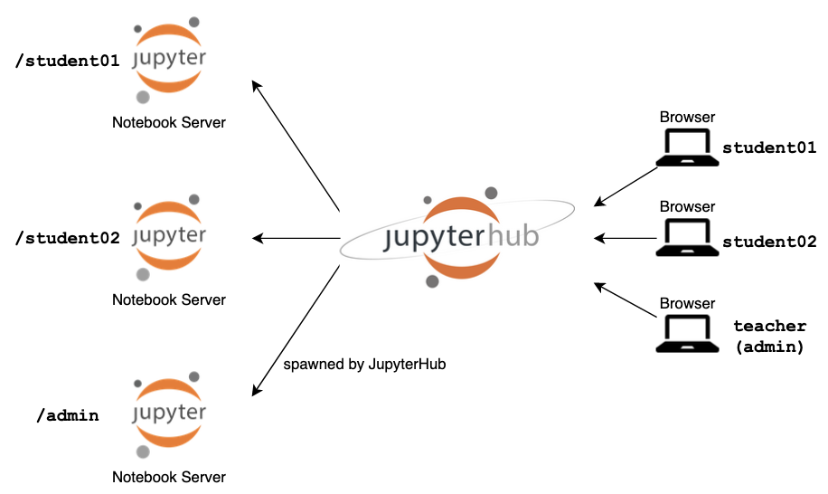

# The Littlest JupyterHub による軽量Python実習環境の構築

[JupyterHub](https://jupyter.org/hub) は、Webブラウザからアクセス可能なマルチユーザ対応の認証機能付きJupyterNotebookサーバです。

JupyterHubを利用して管理者が用意したNotebookをユーザがブラウザからすぐに実行可能な環境を提供できるため、Pythonによるプログラミング研修やワークショップを開催したり、講義演習環境として活用したりするのに適しています。

本テンプレートでは、JupyterHubを小規模なグループで手軽に利用することを想定し、単一のサーバで実行するために開発された「[The Littlest JupyterHub](https://tljh.jupyter.org/)」（以下 “TLJH” と略）をVCPを用いて構築します。  

構築したTLJH環境の操作はWebブラウザ経由で行うことになります。構築するVCノードにブラウザからアクセスできるように事前にネットワークを設定してください。直接アクセスできない場合は、例えばリバースプロキシを使う、DNATで制御する、などの手段があります。

